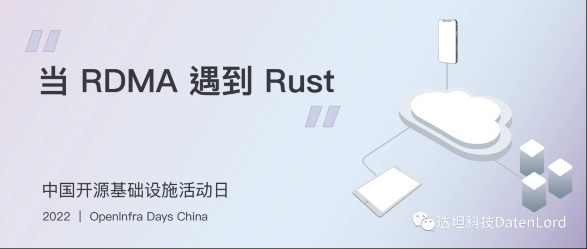
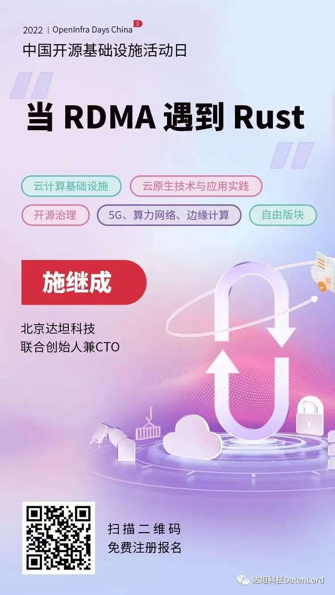

2022 年 8 月 5 日-6 日，**一年一度的中国开源基础设施活动日（OpenInfra Days China）**即将在线上举行。本次会议没有限定一个统一的主题，主要聚焦云计算基础设施、云原生技术与应用实践、开源治理、5G、算力网络与边缘计算五大主题方向。

**云计算基础设施分论坛**主要聚焦云计算基础设施领域的前沿技术和优秀实践，围绕多硬件架构和多操作系统支持、人工智能技术应用、网络与存储，数据处理 DPU 及其他加速硬件、硬件自动化和智能运维等方面展开技术分享和探讨。达坦科技联合创始人施继成将在这一分论坛做题为**当 RDMA 遇到 Rust** 的专题分享。

在大会开始前，我们请施继成就此次活动以关键词**开源、基础设施、Rust、RDMA** 进行了一次快问快答的剧透式分享，欢迎先睹为快：

**问：达坦做存储的底层操作系统为什么选择开源？**  
**答：** 因为在服务器市场，开源是大家的主要选择，选择开源也就选择了用户。另一方面，开源软件能够帮助我们构建健康发展的社区，吸引更多的开发者来加入我们，进一步发展和完善项目。

**问：达坦为什么选择 Rust 做 RDMA 库呢？Rust 语言有什么特点或优势是可以解决 RDMA 目前的技术痛点和难点？**  
**答：** 首先，是实现 Rust 语言直接调用 RDMA 的 API； 其次，实现了更安全、高效地管理 RDMA 的内存资源；最后，是在底层的 RDMA ibverbs 接口上封装高级的抽象层，实现多台机器的内存资源能统一管理。

#### 参会方式

想要了解更多达坦科技为什么选择 Rust 做 RDMA 库，以及开发设计背后的理念、逻辑、和实践经验，欢迎扫描海报二维码，免费注册报名。

有意加入 **Rust 前沿交流讨论群**，请添加小助手微信：

