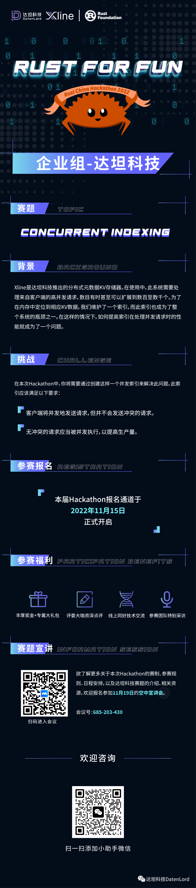

**Rust China Hackathon 2022 即将来袭！** 本届 Hackathon 的主题为「**Rust For Fun**」，分为「**社区组**」与「**企业组**」。

**达坦科技**作为本届 Hackathon 的协办方，赞助参与本次企业组赛道，将基于 **Xline** 这个开源项目，就 Concurrent Indexing，邀请你一起进行思维碰撞。

**Rust China Hackathon 2022**  
企业组：达坦科技（DatenLord）

**主题**  
Concurrent Indexing

**背景**  
Xline 是达坦科技推出的分布式元数据 KV 存储器。在使用中，此系统需要处理来自客户端的高并发请求，数目有时甚至可以扩展到数百至数千个。为了在内存中定位到相应 KV 数据，我们维护了一个索引，而此索引也成为了整个系统的瓶颈之一。在这样的情况下，如何提高索引在处理并发请求时的性能就成为了一个问题。

**挑战**  
在本次 Hackathon 中，你将需要通过创建这样一个并发索引来解决此问题，此索引应该满足以下要求：

1. 客户端将并发地发送请求，但并不会发送冲突的请求。
2. 无冲突的请求应当被并发执行，以提高生产量。

```rust
/// Operations of Index pub(crate) trait IndexOperate<K: Ord, V> {
    /// Get a range of keys in [key, range_end]     fn get(&self, key: &K, range_end: &K) -> Vec<&V>;
    /// delete a range of keys in [key, range_end]     fn delete(         &self,         key: &K,         range_end: &K,     ) -> Vec<V>;
    /// insert of update a key     fn insert_or_update(         &self,         key: K,
        value: V,     ) -> Option<V>; }
```

**评估标准**  
你的实现应遵从上述 Trait 并满足上述要求。我们将使用一定基准测试来进行评估，并根据其结果评分。在基准测试中，我们将发送大量并发请求，因此你也可以创建自己的性能测试来帮助进行优化。



为更全面地向广大 工程师推介 **Rust China Hackathon 2022** 企业组达坦科技的赛题，我们将于 **2022 年 11 月 19 日（周六）下午 2 点整**安排一场**空中宣讲会**。欲了解更多关于本次 Hackathon 的赛制、参赛规则、日程安排，以及达坦科技赛题的介绍、相关资源，欢迎预约报名。


