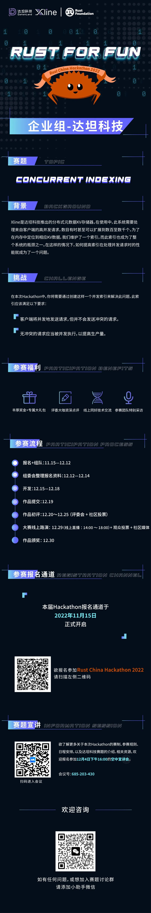

**Rust China Hackathon 2022 即将来袭！** 本届 Hackathon 的主题为「**Rust For Fun**」，分为「**社区组**」与「**企业组**」。

**达坦科技**作为本届 Hackathon 的协办方，赞助参与本次企业组赛道，将基于 **Xline** 这个开源项目，就 Concurrent Indexing，邀请你一起突破固有的思维限制。

## 赛事日程表

本次挑战赛于 **11 月 15 日** 开放报名。赛事日程表已经新鲜出炉：

- **报名+组队：11.15 ～ 12.12**
- 组委会整理报名资料：12.12-12.14
- 开发：12.15 ～ 12.18
- **作品提交：12.19**
- 作品初评：12.20 ～ 12.25 （评委会 + 社区投票）
- 大赛线上路演：12.29（线上直播 ：14:00 ～ 18:00）+ 观众投票 + 社区媒体
- 作品颁奖：12.30

## 空中宣讲会

经过近两周的预热，收到不少开发者的的积极报名，同时，我们也收到大量关于比赛赛制、赛题解读的咨询和提问。为了更全面地向大家推介 Rust China Hackathon 2022 达坦科技组的比赛，我们特安排此次**空中宣讲会**，向有意参赛的工程师解读赛制、介绍日程安排，分享竞赛平台的相关资源，以帮助工程师们顺利完赛。

**直播时间：2022 年 12 月 4 日下午 16:00**



## 达坦科技 DatenLord 赛题

**主题**  
Concurrent Indexing

**背景**  
Xline 是达坦科技推出的分布式元数据 KV 存储器。在使用中，此系统需要处理来自客户端的高并发请求，数目有时甚至可以扩展到数百至数千个。为了在内存中定位到相应 KV 数据，我们维护了一个索引，而此索引也成为了整个系统的瓶颈之一。在这样的情况下，如何提高索引在处理并发请求时的性能就成为了一个问题。

**挑战**  
在本次 Hackathon 中，你将需要通过创建这样一个并发索引来解决此问题，此索引应该满足以下要求：

1. 客户端将并发地发送请求，但并不会发送冲突的请求。
2. 无冲突的请求应当被并发执行，以提高生产量。

```rust
/// Operations of Index
pub(crate) trait IndexOperate<K: Ord, V> {
    /// Get a range of keys in [key, range_end]
    fn get(&self, key: &K, range_end: &K) -> Vec<&V>;
    /// delete a range of keys in [key, range_end]
    fn delete(&self, key: &K, range_end: &K) -> Vec<V>;
    /// insert of update a key
    fn insert_or_update(&self, key: K, value: V) -> Option<V>;
}
```

**评估标准**  
你的实现应遵从上述 Trait 并满足上述要求。我们将使用一定基准测试来进行评估，并根据其结果评分。在基准测试中，我们将发送大量并发请求，因此你也可以创建自己的性能测试来帮助进行优化。

欢迎预约报名 **2022 年 12 月 4 日 16:00** 的空中宣讲会！
腾讯会议二维码如下：


