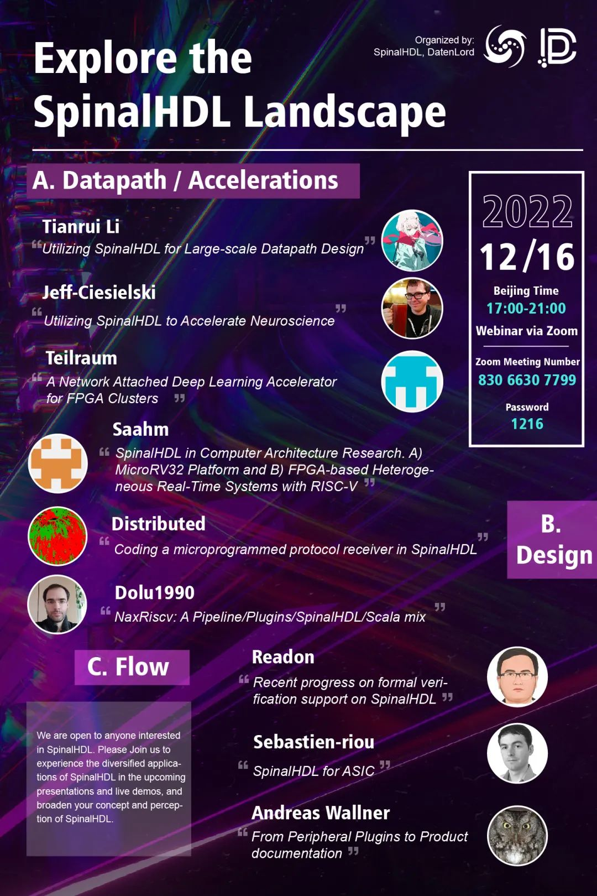

新一代硬件描述语言 SpinalHDL 的发明人 Charles Papon 说，SpinalHDL 始于 2014 年，最初是作为 VHDL/Verilog 的替代而做的创新尝试，伴随着数年来开源硬件设计的蓬勃发展，基于开源技术的硬件设计方法和范式逐渐受到业界的关注，那么 SpinalHDL 有哪些最新的进展和落地实践呢？

## 线上研讨会

**达坦科技（DatenLord）** 致力于打造高性能跨云存储，其通过软硬件深度融合的方式打破云之间的壁垒，实现高性能跨云数据访问，提供海量异地、异构数据的统一存储访问机制，为云上应用提供高性能安全存储支持。达坦科技采用硬件加速提升存储性能，目前采用 FPGA、ASIC 实现存储相关场景的性能加速。SpinalHDL 是达坦科技在产品中使用的硬件描述语言之一，达坦科技也一直热心于推广 SpinalHDL 在业界的落地应用。

为了让对开源硬件感兴趣的朋友进一步了解 SpinalHDL，在北京时间 **2022 年 12 月 16 日下午 17:00-21:00**，达坦科技联合 SpinalHDL 社区举办一场题为《**SpinalHDL 应用前景探索**》的线上研讨会（Webinar），本研讨会分三个讨论分主题，分别为：**数据通路加速**（Datapath/Accelerations）、**复杂系统设计案例**（Design）、**硬件设计流程** （Flow）。

欢迎所有对开源硬件及 SpinalHDL 感兴趣的朋友，参加我们的**线上研讨会** ，观看分享和在线演示

**主题**：Explore the SpinalHDL Landscape  
**时间**：2022 年 12 月 16 日 17:00 （北京时间）  
**加入 Zoom 会议**：
https://zoom.us/j/83066307799?pwd=Z0ZyNWdnaDhMNHNrQWJCWi9OaVpjUT09  
**会议号**：830 6630 7799  
**密码**：1216

对开源硬件感兴趣的朋友，可以添加小助手微信，加入**达坦科技硬件群**。

