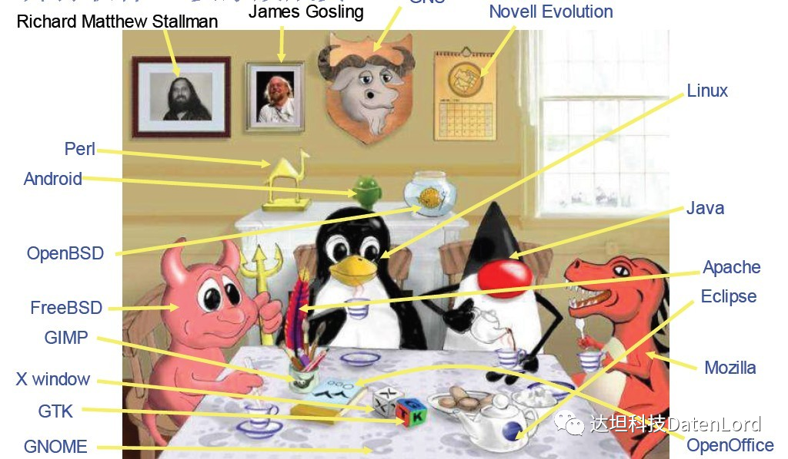
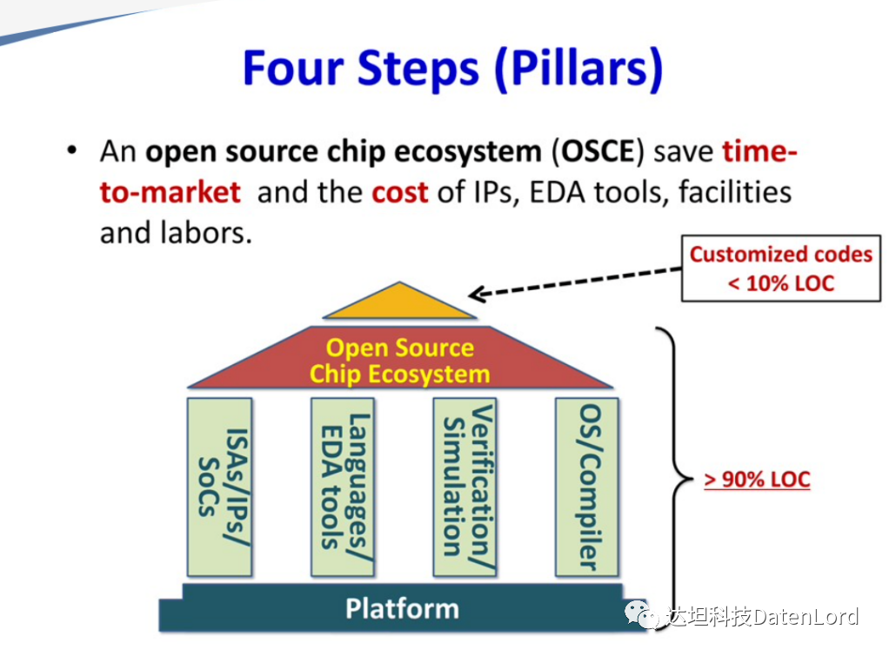
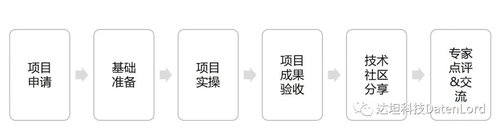

自 1984 年 Richard Stallman 发起 GMU 和 Free Software Foundation，开源作为一种全新的软件开发和使用模式正式诞生。**One for All, All for One** 的理念传播开后，之后的 40 年里在开源软件社区被无数开发者实践和传承。开源软件因其节省费用（不需要购买许可证，大大降低了 IT 投入成本）、安全稳定（安全漏洞少）、技术成熟、个性化定制、自主知识产权等优势获得喜人的发展，由此我们也见证了无数开源软件项目的成长和成熟

相比而言，硬件开源之路更为崎岖。因为对物理器件的依赖度更高，复杂度更高，修改难度大，硬件开源之路走得比较缓慢。虽然是一条少有人走的路，但其正确性毋庸置疑。开源芯片生态（Open Source Chip Ecosystem-OSCE）的优势,包括可以节约市场化时间，以及知识产权的成本，EDA 工具、设施和劳动力。硬件开发者也期盼硬件设计可以像软件设计一样简单。

为此在 2023 年伊始，达坦科技联合中国计算机协会 OpenDACs，开放原子基金会以及中国开源领域的布道者和开拓先锋西安邮电大学**陈莉君教授**和华南理工大学计算机学院 **赖晓铮副教授**一同推出开源毕业设计实习项目。我们希望在校高年级的本科生可以：

1. 不仅了解，而是亲身参与到最 in 的中国开源技术的起步和发展中，体验透明开源和知识共享带来的乐趣，并在社区的反馈中获得技术成长。

2. 弥合学校和工业界实践的脱节和差距，在 hands-on 的毕业设计中，系统梳理学校的知识结构，并运用到具有影响力的实践项目中。

3. 手把手地获得多位行业内的专家、教授、学者的点评以及前沿科研项目的合作机会。

4. 因为本次毕业设计项目全程开源，在硬核的开源技术社区自我展示的机会是所有同学未来升学以及就业最佳、最强有力的 Reference。

2023 年达坦科技开源毕业设计实习项目的主题是关于**通用的 eBPF+WASM 的无服务器计算平台**。

## 毕设项目的背景

WebAssembly（缩写 WASM）是基于堆栈虚拟机的二进制指令格式，可作为 C、C++、Rust 等高级语言的编译目标，使客户端和服务器应用程序能够在 Web 上部署。尽管 WASM 是为了提高网页中性能敏感模块表现而提出的字节码标准, 但是 WASM 却不仅能用在浏览器中, 也可以用在其他环境中。WASM 已经发展成为一个轻量级、高性能、跨平台和多语种的软件沙盒环境，被运用于云原生软件组件。与 Linux 容器相比，WASM 的启动速度可以提高 100 倍，内存和磁盘占用空间要小得多，并且具有更好定义的安全沙箱。然而，相对而言 WASM 需要自己的编译器工具链，使其成为比 Linux 容器更受限制的开发环境。WASM 越来越多地用于难以部署 Linux 容器或应用程序性能至关重要的边缘计算场景。

eBPF 源于 BPF，本质上是处于内核中的一个高效与灵活的虚拟机组件，以一种安全的方式在许多内核 hook 点执行字节码。开发者可基于 eBPF 开发性能分析工具、软件定义网络、安全等诸多场景。eBPF 有一些编程限制，需要经过验证器确保其在内核应用场景中是安全的（例如，没有无限循环、内存越界等），但这也意味着 eBPF 的编程模型不是图灵完备的。相比之下，WASM 是一种图灵完备的语言，具有能够打破沙盒和访问原生 OS 库的扩展 WASI (WebAssembly System Interface, WASM 系统接口) ，同时 WASM 运行时可以安全地隔离并以接近原生的性能执行用户空间代码。

在 Serverless 架构中，开发者与用户无需关注服务器的运维与费用，而是将关注点投入在实现业务逻辑的代码上，并按实际资源使用量交费。在不降低用户体验的前提下，Serverless 极大降低了开发与运营的成本。我们希望通过 eBPF 和 WASM 相结合，提供快速、安全、跨平台的计算引擎来补充虚拟机和容器，实现 Serverless 许多未实现的目标。

## 细分方向

该毕业设计项目下辖四个细分方向，供有兴趣的本科生选择：

1. MITOSIS in eBPF and WASM
2. RDMA and eBPF with WASM
3. RDMA in eBPF
4. Parallel Computing in eBPF and WASM

## 开源毕设导师组

**陈莉君** 西安邮电大学 教授
**赖晓铮** 华南理工大学计算机学院 副教授

## 开源毕设项目的流程

## 申请流程

1. **简历投递：** 需罗列本人擅长的专业技能、过往项目经历、研究成果等。
2. **技能考察：** 为期 2 天的项目题目考查。
3. **自学：** 项目必备基础知识准备，有 mentor 答疑。
4. **正式实习：** 远程、长期直至毕业设计答辩完成。

如果你对开源毕业设计感兴趣，对毕设的项目要求和细节解读有疑问，对毕设的申请及流程想咨询，欢迎大家参与 2023 年 1 月 8 日 20：00 的直播。

欢迎您预约直播，或者登陆腾讯会议观看直播：

对开源毕设感兴趣的朋友，欢迎添加小助手微信，加入达坦科技开源毕设群。

