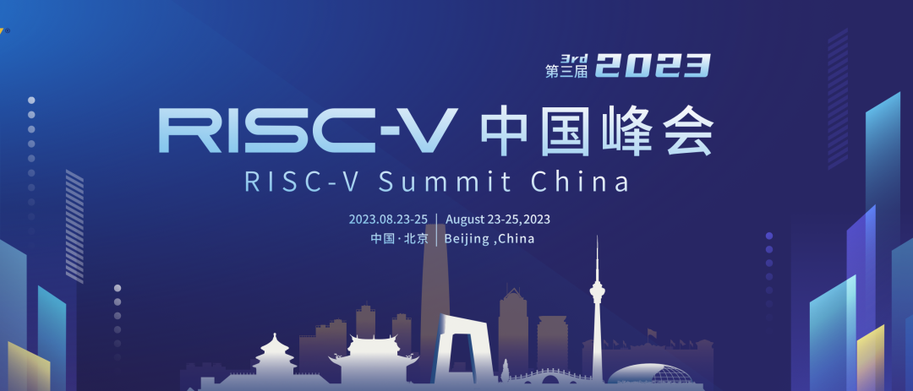
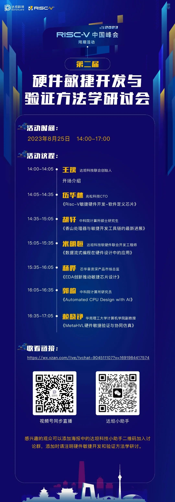

## 2023 RISC-V中国峰会

2023年8月23日至25日， 2023 RISC-V中国峰会将在北京香格里拉饭店举办。本届峰会采用“主会议+主题活动+展览展示+同期活动”的会议组织方式，将邀请RISC-V国际基金会、业界专家、企业代表及社区伙伴等共同探讨RISC-V发展趋势与机遇。作为本届RISC-V中国峰会的同期活动，**8月25日下午**，达坦科技将在线上举办**第二届硬件敏捷开发与验证方法学研讨会**。

随着数字芯片的设计规模和复杂度越来越大，加之芯片市场的竞争越来越激烈，如何提升数字芯片的开发和验证效率成为业界关注的焦点。虽然各种设计工具、验证方法学层出不穷，但是一直没有得到业界广泛认可。目前业界普遍采用的还是基于Verilog、SystemVerilog、VHDL和UVM的工具和方法。

如何提升数字芯片的开发和验证效率一直是业界关注的焦点。近年来随着Chisel、SpinalHDL等等一众新一代HDL的推出，业界逐步感受到新一代HDL在数字芯片设计效率方面的提升。相比Verilog和VHDL，这些新一代HDL在语法表达能力、代码简洁程度、错误检查等方面有不小的提升；相比高阶综合HLS，这些新一代HDL支持RTL级描述能力，在芯片性能的把控方面远超HLS。此外，以Cocotb和pyuvm为代表的新一代验证框架的推出，使得验证的周期得到一定程度的缩减，特别是Cocotb可以复用Python生态丰富的已有工具和模型，大大减少了Golden Reference的工作量。

更重要的是，这些新一代HDL打开了全新的数字芯片敏捷设计和验证的方法学大门。本次研讨会将邀请业界多位专家分享他们在各自领域的**硬件敏捷开发与验证实践经验**，为业界提供一次深入探讨和交流的机会，促进硬件敏捷开发与验证方法学的发展与落地。

参与本次研讨的听众可以深入了解业界关于硬件敏捷开发与验证的最前沿探索，诸如：

1. **新一代HDL在数字芯片设计方面的实践经验**；
2. **新一代验证框架在数字芯片验证方面的实践经验**；
3. **硬件敏捷开发与验证和已有芯片研发流程结合的实践经验**。

## 活动信息

***活动时间：2023年8月25日，14:00-17:00***

**收看链接：**  
https://wx.vzan.com/live/tvchat-904511107?v=1691984417574  
或欢迎点击下方链接预约公众号直播。

感兴趣的观众可以添加海报中的**达坦科技小助手二维码**加入讨论群，添加时**请注明硬件敏捷开发和验证方法学研讨**。