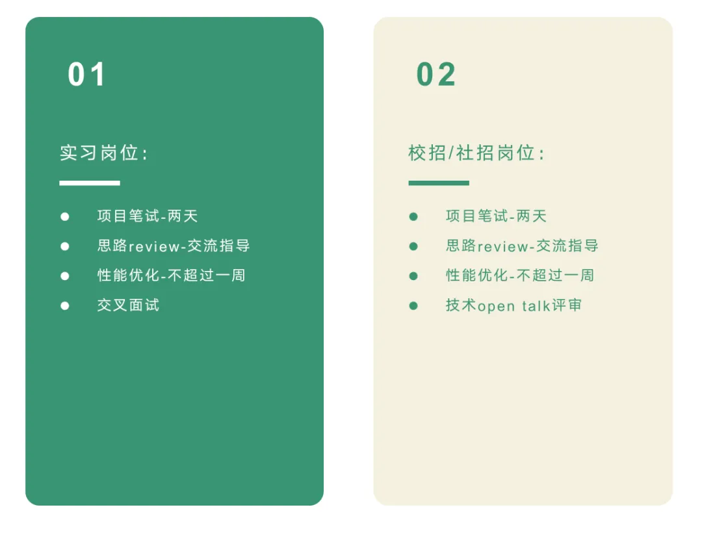

## 01 我们是谁

**达坦科技始终致力于打造高性能 Al+ Cloud 基础设施平台 DatenLord，积极推动 AI 应用的落地。** DatenLord 通过软硬件深度融合的方式，提供高性能存储和高性能网络。为 AI 应用提供弹性、便利、经济的基础设施服务，以此满足不同行业客户对 AI+Cloud 的需求。

## 02 我们是怎样的一群人

达坦科技创始团队均来自谷歌、微软、阿里等知名科技公司，团队成员都是一群喜欢并勇于探索前沿技术的同学，大家因为对技术的热爱而聚到一起。

在这里我们不局限于工作职责本身，更鼓励大家能勤于思考学习，找到自己感兴趣的事情，创造更多价值。

## 03 我们的公司文化是怎样的

- 持续学习 持之以恒的自驱学习，求真求致
- 积极主动 遇到问题主动踏出第一步，做先行者而不是追随者
- 精益求精 对自己高标准严要求，对创新有极致追求

与一群真正热爱自己所做的事情并追求挑战的人为伍！

## 04 达坦科技 2024 开放招募实习岗位

### 一、Rust 分布式存储开发（远程实习）

【岗位职责】参与高性能分布式存储系统研发，涉及的开发内容包括但不限于：

1.  分布式数据一致性协议；
2.  高速网络传输接口、驱动；
3.  分布式缓存、数据管理服务；
4.  对象存储接口；
5.  文件存储接口；
6.  块存储接口。

【岗位要求】

1.  熟悉 Rust 和 C 语言；
2.  熟悉多线程、高并发编程；
3.  熟悉 Docker 和 K8S 等容器相关工具；
4.  熟悉 Linux 操作系统；
5.  具有很强的学习能力，自我驱动以及团队合作意识。

【加分项】

1. 熟悉 Rust 异步编程、有 tokio 或 async-std 使用经验优先；
2. 熟悉 Linux 内核 IO 相关功能，有 io_uring、ext4、FUSE、eBPF 相关开发经验优先；
3. 有 Linux 内核模块、驱动相关开发经验优先；
4. 有 lock-free 编程经验优先；
5. 熟悉分布式一致性协议 Paxos 或 Raft 优先；
6. 有 DPDK 或 RDMA 等高性能网络编程经验优先；
7. 有 SPDK、Ceph、Key-Value 等存储相关编程经验优先；
8. 有 K8S 的 CSI 接口编程经验优先；
9. 能长期实习优先。

### 二、Rust 高性能网络系统开发 （远程实习）

【岗位职责】  
参与研发高性能网络系统开发，涉及的工作包括但不限于：

1. 网络硬件 Linux 驱动开发；
2. 网络流量控制算法设计与实现；
3. 网络仿真系统开发与测试。

【岗位要求】

1. 熟悉 Rust 和 C 语言；
2. 熟悉多线程、高并发编程；
3. 熟悉 Docker、KVM 等容器和虚拟化相关工具；
4. 熟悉 Liux 操作系统网络管理相关功能；
5. 具有很强的学习能力，自我驱动以及团队合作意识。

【加分项】

1. 熟悉 Rust 异步编程、有 tokio 或 async-std 使用经验优先；
2. 熟悉 Linux 内核 IO 相关功能，有 eBPF、XDP 相关开发经验优先；
3. 有 Linux 内核网络模块相关开发经验优先；
4. 有无损以太网流量控制相关的开发经验优先；
5. 熟悉常见流量控制算法优先，诸如 BBR、CUBIC、QCN 等；
6. 有 DPDK 或 RDMA 等高性能网络编程经验优先；
7. 有 P4、OpenFlow、NS3、SONiC 等相关编程经验优先；
8. 有 K8S 的 CNI 接口编程经验优先；
9. 能长期实习优先。

### 三、AI 平台研发 （远程实习）

【岗位职责】

1. 负责大模型平台后端的开发研发，根据产品和项目计划按时完成功能模块的架构设计、编码、测试的全流程工作。
2. 负责持续优化系统架构，提供高并发的数据请求分析的处理能力，提高系统的容灾容错能力，保证系统的可运维、高可用性、高可靠性。

【岗位要求】

1. 具备全面的软件知识结构，基础扎实，熟悉常用数据结构与算法。
2. 熟练使用 Python 语言，熟悉使用常用模块，完成过基于 Python 的中大型项目。
3. 熟练使用 MySQL、Redis、Nginx、Flask、MongoDB 等。
4. 熟悉 Linux 操作，了解 Shell 脚本，有 Linux 下的多线程编程经验，有性能调优经验。
5. 有开源项目贡献经验者优先。
6. 熟悉机器学习，能够使用 PyTorch、TensorFlow 等框架者优先。
7. 熟悉网络编程的基本模型和方法，有实际项目的开发经验者优先。

### 四、FPGA 开发（远程实习）

【岗位职责】

1.  负责基于 FPGA 实现网络 IO 加速，以及加密、压缩、编码等算法加速的设计与 RTL 实现；
2.  实现常用外设接口 IP 的 RTL 设计、集成和验证；
3.  参与 SoC 集成设计与验证；
4.  撰写相关设计文档。

【岗位要求】

1.  熟悉基于 FPGA 的设计流程，熟悉 Xilinx 的 FPGA 芯片架构，熟练掌握 Xilinx 的 FPGA 开发工具；
2.  熟悉 Bluespec、SpinalHDL、Chisel 或 Clash 等新一代 HDL 语言；
3.  熟练掌握 Verilog、SystemVerilog 或 VHDL 语言；
4.  熟悉 SystemVerilog Assertion 的使用；
5.  熟练掌握 TCL 脚本语言；
6.  具有很强的学习能力，自我驱动以及团队合作意识；

【加分项】

1.  有网络或存储硬件系统开发经验优先；
2.  熟悉 PCIe、DMA、NVMe、DDR3/4、SerDes 等相关接口开发优先；
3.  有 DSP 领域相关经验、熟悉 LDPC、喷泉码、椭圆曲线加密算法和零知识证明算法优先；
4.  熟悉 AXI、ACE、CHI 等 AMBA 总线协议；
5.  熟悉基于 Python 的仿真测试工具 Cocotb 优先；
6.  熟悉 TCP/IP 或 InfiniBand/RDMA 网络协议栈优先。
7.  能长期实习（6 个月以上）优先。

### 五、软硬件联合研发（远程实习）

【岗位职责】  
参与高性能存储 SoC 芯片的软硬件开发：

1.  负责网络 IO 加速的 RTL 实现；
2.  负责加密、压缩、编码等算法加速的设计与 RTL 实现；
3.  负责 SoC 芯片的 Linux 驱动开发；
4.  负责实现软硬件联合调试与自动化测试。

【岗位要求】

1.  熟悉 IC 设计流程，熟悉常用的仿真、综合等 EDA 工具；
2.  熟悉 Xilinx 的 FPGA 设计流程，熟练掌握 Xilinx 的 FPGA 开发工具；
3.  熟悉 Bluespec、SpinalHDL 或 Chisel 等新一代 HDL 语言；
4.  熟练掌握 Verilog、SystemVerilog 和 SystemC 语言；
5.  熟悉 Linux 开发内核模块、驱动；
6.  熟悉基于 QEMU 的软硬件联合调试工具链；
7.  具有很强的学习能力，自我驱动以及团队合作意识。

【加分项】

1.  有网络或存储硬件系统开发经验优先；
2.  熟悉 TCP/IP 或 InfiniBand/RDMA 网络协议栈优先；
3.  熟悉 CXL、PCIe、AXI、ACE、CHI、NVMe 等协议接口开发优先；
4.  有 DSP 领域相关经验，熟悉 LDPC、喷泉码、椭圆曲线加密算法和零知识证明算法优先；
5.  有 Linux 内核网络、文件、存储相关开发经验优先；
6.  熟悉 Rust for Linux 开发内核模块、驱动开发经验优先；
7.  能长期实习（6 个月以上）优先。

### 六、数字 IC 前端设计（远程实习）

【岗位职责】  
参与高性能存储 SoC 芯片开发：

1. 负责实现网络 IO 加速，以及加密、压缩、编码等算法加速的设计与 RTL 实现；
2. 负责实现 SoC 的集成、综合与原型验证；
3. 负责实现常用外设接口 IP 的 RTL 设计、集成；
4. 撰写相关设计文档。

【岗位要求】

1. 熟悉数字 IC 的开发工具链；
2. 熟悉 Bluespec、SpinalHDL 或 Chisel 等新一代 HDL 语言；
3. 熟练掌握 Verilog、SystemVerilog、SystemC 语言；
4. 熟悉 SystemVerilog Assertion 的使用；
5. 熟练掌握 TCL 脚本语言；
6. 具有很强的学习能力，自我驱动以及团队合作意识。

【加分项】

1. 有网络或存储硬件系统开发经验优先；
2. 熟悉 TCP/IP 或 InfiniBand/RDMA 网络协议栈优先；
3. 熟悉 CXL、PCIe、AXI、ACE、CHI、NVMe 等协议接口开发优先；
4. 有加密和编码领域相关经验，熟悉 LDPC、喷泉码、椭圆曲线加密算法和零知识证明算法优先；
5. 熟悉基于 Python 的仿真测试工具 Cocotb 优先；
6. 有形式化验证相关经验优先；
7. 能长期实习优先。

## 05 面试流程以及薪资待遇

**【如何申请】**  
有意向的同学可以发送简历至：  
**info@datenlord.com**  
或者添加达坦科技小助手微信:  
**DatenLord_Tech**

**【面试流程】**  
简历评估合格后，面试流程为：

具体面试流程会根据候选人的情况略有调整。

**【薪资待遇】**  
**实习生：** 入职初期为 300 元/天，如能力和产出优秀将予以薪资调增，最高 500 元/天。  
**正式员工：** 对标国内一线大厂的薪资+期权，待面试通过后根据能力情况确定。

**【更多官方信息】**  
【公众号】达坦科技 DatenLord  
【知乎账号】  
https://www.zhihu.com/org/da-tan-ke-ji  
【B 站】  
https://space.bilibili.com/2017027518

我们相信物以类聚、人以群分，希望找到同样富有激情的你，一起成长~

更多信息，可扫描下方二维码加微信咨询：

