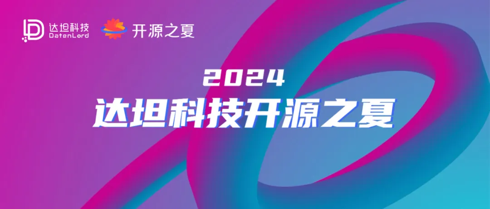

开源之夏（英文简称“OSPP”）是中科院软件所“开源软件供应链点亮计划”指导下的系列暑期活动。达坦科技自开源之夏创办首期起每年参与，积极鼓励在校学生积极参与开源软件的开发维护，培养和发掘更多优秀的开发者。今年，达坦科技一如既往带着对开源的热忱与初心，携旗下开源项目第五次参与开源之夏。

## 开源之夏为什么值得参加？

- 结识开源界小伙伴和技术大牛
- 获得社区导师的专业指导，与开源项目开发者深度交流
- 丰富项目实践经验，提升项目开发技能
- 通过结项考核的学生将获得结项奖金和结项证书，更有机会获选优秀学生

## 达坦科技项目列表

### 题目一

**项目名称：为开源 RDMA 网卡驱动程序适配 NVIDIA 或 AMD GPU**

**项目描述：** 随着 AI 浪潮的到来，读写 GPU 显存成为了 RDMA 网卡必须支持的功能之一。本项目需要为开源 RDMA 网卡 blue-rdma 编写对应的内核态及用户态驱动程序，从而使之能够支持对 N 卡或 A 卡显存进行访问的能力。其中用户态驱动使用 Rust 开发，部分功能涉及到 Linux Kernel 开发以及 C-FFI 调用交互。

**项目备注：**  
https://docs.nvidia.com/cuda/gpudirect-rdma/index.html  
https://rocm.docs.amd.com/en/latest/

**项目难度：** 进阶

**项目产出要求：**

- 设计文档
- 扩展 blue-rdma 的内核态及用户态驱动程序，使得上层应用可以将显存注册为 RDMA 的 Memory Region，从而使得 blue-rdma 网卡具备对远程 GPU 显存的读写能力。
- 测试用例

**项目技术要求：**

- 熟悉 Rust 语言
- 熟悉 Linux Kernel 开发
- 对计算机体系结构有一定了解

**项目成果仓库：**  
https://github.com/datenlord/open-rdma

### 题目二

**项目名称：为开源 RDMA 网卡适配 lumina 测试工具**

**项目描述：** lumina 是微软开源的一款 RDMA 网卡测试工具，由于 blue-rdma 项目对标准 RDMA 协议进行了优化调整，因此无法直接使用 lumina 测试工具。本项目要求参与者修改 lumina 项目，使之能够适配 blue-rdma 所使用的通信协议。

**项目备注：**  
github.com/lumina-test/lumina  
https://www.cs.jhu.edu/~zhuolong/papers/sigcomm23lumina.pdf

**项目难度：** 进阶

**项目产出要求：**

- 设计文档
- 编写 P4 交换机的数据包处理代码，使之能够解析修改后的 RDMA 协议。
- 编写与 blue-rdma 协议所对应的测试用例，测试 blue-rdma 在丢包、乱序情况下的性能表现。

**项目技术要求：**  
熟悉 C、Python 语言  
有很强的学习能力，能够快速掌握 P4 交换机开发、能够快速掌握 RDMA 协议的基本概念和编程模型

**项目成果仓库：**  
https://github.com/datenlord/open-rdma

## 学生参与指北：

- 成功注册报名的学生自由选择项目。
- 对于感兴趣的项目，学生与社区导师沟通实现方案，并在官网提交项目计划书。
- 被选中的学生将在社区导师指导下，按计划完成项目开发工作，并将成果贡献给社区。
- 社区评估学生的完成度，主办方根据评估结果，给出最终评审结论并发放活动奖金。
- 详情请参考：  
  https://summer-ospp.ac.cn/help/student/

## 活动日程

**03/11 - 03/31**  
社区报名与审核

**04/30 - 06/04**  
学生注册、与导师沟通项目、提交项目申请  
当前

**06/05 - 06/25**  
项目申请审核

**06/26**  
中选公示

**06/26 - 06/30**  
项目开发预热

**07/01 - 09/30**  
项目开发

**10/01 - 10/31**  
结项审核-PR/MR 合并与导师审核

**11/01 - 11/08**  
结项审核-组委会成果审核

**11/09**  
结项公示

对于报名方式有任何疑问，或者对某一个任务非常感兴趣，并且想要深入了解的同学，欢迎扫码添加小助手微信：**DatenLord_Tech,或发邮件至info@datenlord.com**

“开源之夏”活动在众多的开源项目与高校学生之间搭建了一座桥梁。同学们通过参与“开源之夏”的活动，在开源项目导师的指导下，不但可以丰富项目实践经验，提升项目开发的技能，而且可以与开源项目的开发者进行深度的交流，以一种最直接的方式了解开源，深入开源，为后续的学业方向提供参考，职业发展积累人脉。欢迎各位同学热情参与体验 DatenLord 的开源之夏项目！
