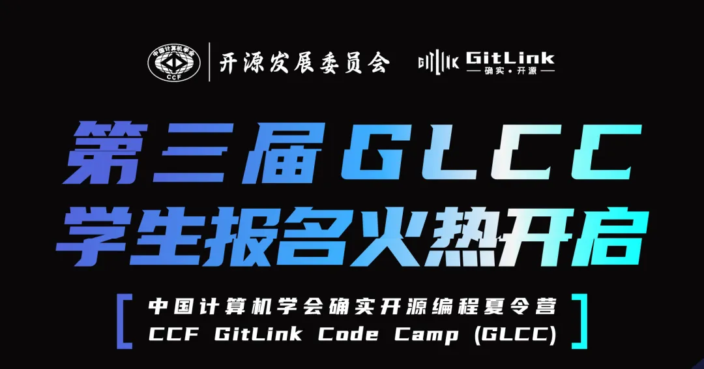
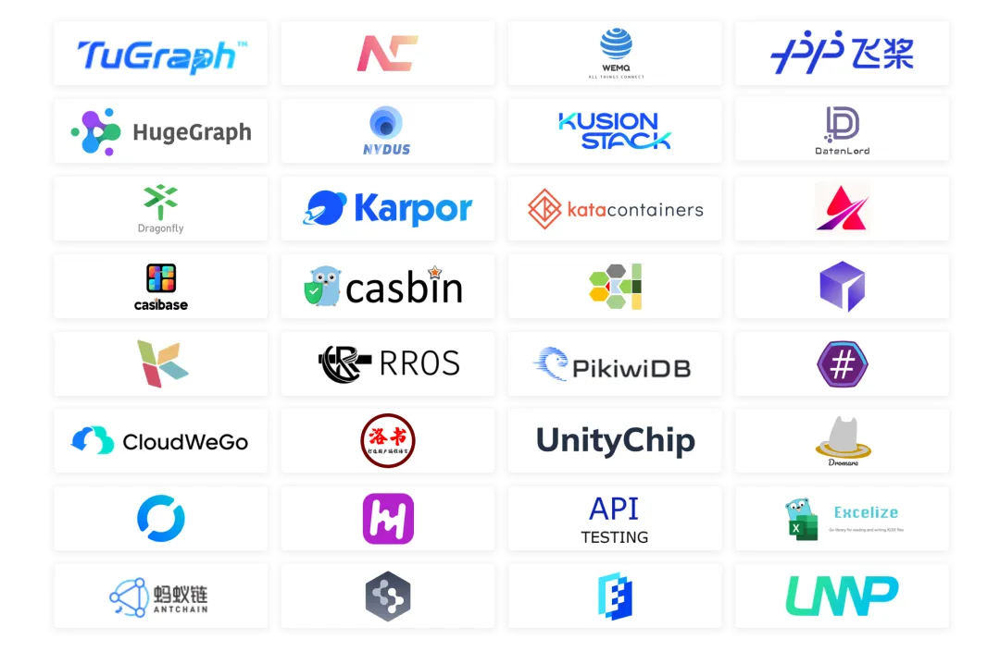
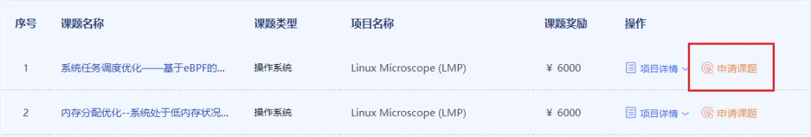
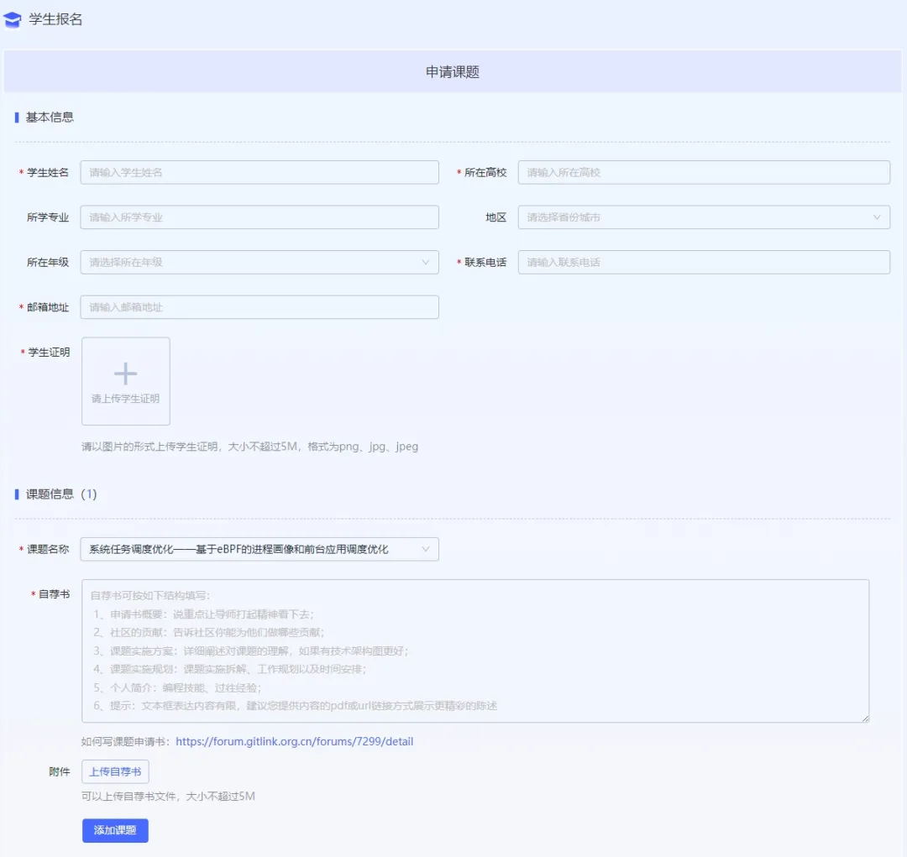
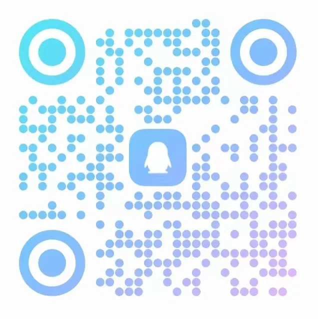
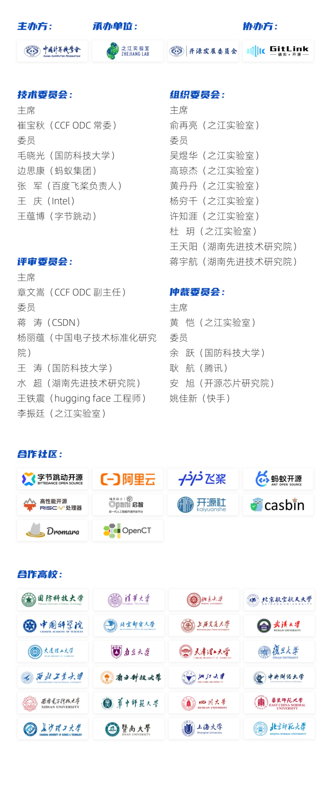

达坦科技始终致力于打造高性能 Al+ Cloud 基础设施平台，积极推动 AI 应用的落地。达坦科技通过软硬件深度融合的方式，提供高性能存储和高性能网络。为 AI 应用提供弹性、便利、经济的基础设施服务，以此满足不同行业客户对 AI+Cloud 的需求。

达坦科技此次参与GitLink“确实开源”编程夏令营(GLCC)，我们的开源项目题目为：为开源RDMA网卡编写测试工具。

课题简介：为了对RDMA网卡进行功能测试，需要在line-rate的条件下创建出数据包乱序、丢包、重复等情况。目前已有的解决方案大多需要昂贵的P4交换机来实现。本项目要求使用HDL语言在FPGA上实现指定模式的数据包收发功能。

课题链接：https://www.gitlink.org.cn/datenlord/open-rdma/issues/1

导师信息：米明恒

联络方式：mingheng.mi@datenlord.com

## 报名方式
现在，让我们再来复习一下报名的细节：

报名截止时间：

2024年7月4日17:00，别错过哦！

报名方式：

1.登录GLCC官网（GitLink确实开源）查看课题列表：  

https://www.gitlink.org.cn/GLCC

2. 点击最下方【阅读原文】即可跳转官网

3. 扫码进入官网报名

## 关于GLCC
第三届GitLink“确实开源”编程夏令营（GLCC）是由中国计算机学会（CCF）主办，CCF 开源发展委员会与之江实验室承办的面向全国高校学生的暑期编程活动。GLCC致力于激励青年学子通过参与真实的开源软件开发实践，锤炼自身技术实力，为开源社区注入新鲜血液，共同推动国内开源社区的蓬勃发展。

第三届GLCC将于活动官网（GitLink |确实开源）和公众号（CCF 开源发展委员会）陆续发布入选课题介绍，敬请期待！

扫码关注公众号获取GLCC最新内容

## 为什么加入GLCC

### 01深入开源实践

直接投身开源项目，深入了解社区运作，提升代码编写与协作能力。

### 02灵活远程实习

提供远程实习机会，让你能自由安排工作时间，兼顾学业与职业发展。

### 03导师一对一指导

每位学生配备资深导师，全程一对一指导支持和经验分享。

### 04拓宽人脉网络

与志同道合的伙伴以及开源社区技术大咖深入交流，拓宽职业视野。

### 05丰厚奖励与认证

完成开源任务即可获得税前6000至12000元不等的奖金及结项证书，还有机会获得赛事周边与项目认证等。

### 06名企实习机会

表现优秀的同学将有机会进入知名企业实习，为职业生涯开启新篇章。
众多开源社区参加GLCC

目前GLCC已经进入学生申请题目阶段，覆盖大模型、人工智能、操作系统、云原生、编程语言、大数据、运维监控、系统工具等30多个技术领域，课题难度分级，等你来挑选。
## 参与社区

## GLCC学生时刻表
**1. 5月31日-7月4日**

学生报名，提交proposal。

**2. 7月8日**

公示入选学生名单。

（7月6日进行二次报名，第一次落选的同学不要灰心哦）

**3.  7月9日-8月18日**

 项目开发第一阶段。

**4. 8月30日**

项目中期考核，公示考核结果。

**5.  8月31日-10月20日**

项目开发第二阶段。

**6.  10月31日**

结项审核，公示考核结果。

**7.  11月初**

公布优秀项目/学生颁奖典礼。

## 高校学生如何参与
### 01报名时间：

2024.5.31-2024.7.4
### 02申请步骤：

www.gitlink.org.cn/glcc/2024/subjects
同学们根据个人专业情况，技术爱好以及所选开源组织的技术类型和参与门槛及奖金等情况筛选出自己喜欢的课题；

②点击“课题列表”中每个课题后的“申请课题”，进入报名信息页面填写“个人基本信息”和“课题申请书”，并提交;

③组委会收到申请后，审核通过后推荐给该课题所属项目导师，提交后的信息可再次更新。建议同学们同时也发送邮件跟导师联系；

④加入GLCC官方QQ交流群，或发邮件到glcc@ccf.org.cn，关注活动进展和咨询；

扫码加入GLCC官方QQ交流群
⑤7月8日公布学生中选情况并通过邮件通知，也可再次登陆官网查看。

### 03注意事项：

①GLCC面向18岁以上的在校学生，请诚实提交在校学生证明材料组委会会对提交材料进行审核；

②申请阶段，GLCC允许每个学生同时提交最多2个课题申请。申请结束后，经过与课题导师双向沟通，每个学生最终只能选择完成一个课题；

③GLCC的每个课题都公布了导师的姓名/ID和邮箱地址，建议提前通过邮件方式和导师建立联系，反复沟通后再提交申请材料，你有充足的时间去了解你将要承担的课题；

④ 建议在截止日期前三天完成提交，避免因最后大量学生提交申请导致网络拥堵；

⑤CCF中国计算机学会学生会员申请优先推荐。

### 04学生申请指南：

GLCC为同学们申请过程中遇到的问题提供了丰富的辅导文档，可在官网查看“帮助文档-学生指南”获取。

官网链接：

https://www.gitlink.org.cn/glcc/help

扫码进入【学生指南】页面
## 协同举办体系
