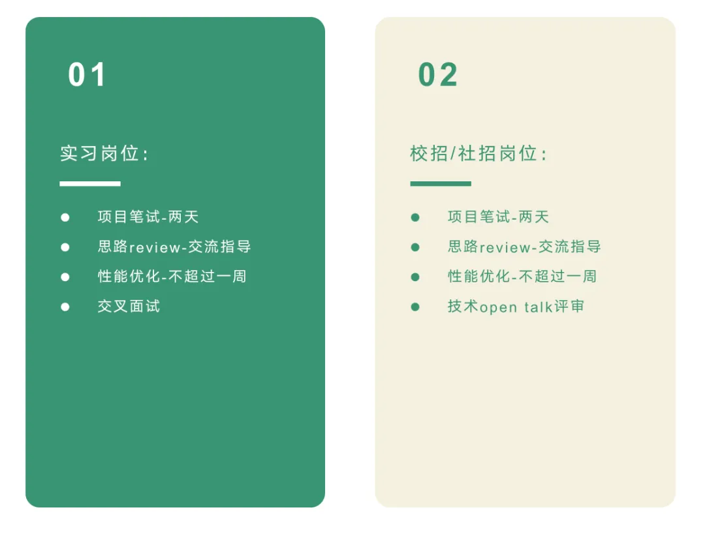

我们是谁？

达坦科技始终致力于打造高性能Al+ Cloud 基础设施平台DatenLord，积极推动AI应用的落地。DatenLord通过软硬件深度融合的方式，提供高性能存储和高性能网络。为AI 应用提供弹性、便利、经济的基础设施服务，以此满足不同行业客户对AI+Cloud 的需求。

## 我们是怎样一群人
达坦科技创始团队均来自谷歌、微软、阿里等知名科技公司，团队成员都是一群喜欢并勇于探索前沿技术的同学，大家因为对技术的热爱而聚到一起。
在这里我们不局限于工作职责本身，更鼓励大家能勤于思考学习，找到自己感兴趣的事情，创造更多价值。
## 我们的公司文化是怎样的
**持续学习**  持之以恒的自驱学习，求真求致

**积极主动** 遇到问题主动踏出第一步，做先行者而不是追随者

**精益求精**  对自己高标准严要求，对创新有极致追求
与一群真正热爱自己所做的事情并追求挑战的人为伍！
## 达坦科技最新开放招聘岗位
**职位名称：机器学习实习工程师**

**职位类型**：实习

**工作时间**：全职/兼职

**职位描述**：

我们正在寻找一位充满热情并有志于在机器学习领域发展的实习工程师，加入我们的技术团队。作为机器学习实习工程师，你将有机会参与实际项目，应用最新的机器学习技术，并在资深工程师的指导下不断提升自己的技能。

**主要职责**：

- 参与机器学习模型的设计、开发和优化

- 参与数据预处理、特征工程和数据可视化

- 参与收集、清洗和分析大型数据集

- 实施和评估机器学习算法和模型

- 编写高质量、可维护的代码

- 参与团队讨论，分享研究成果和技术难点

- 撰写技术文档和报告

**职位要求：**

- 计算机科学、数据科学、人工智能或相关专业的本科或研究生在读

- 对机器学习和数据科学有浓厚的兴趣，并有相关课程或项目经验

- 熟悉Python编程语言及相关数据科学库（如NumPy、Pandas、Scikit-learn等）

- 了解常见的机器学习算法（如线性回归、决策树、SVM、神经网络等）

- 良好的数据处理和分析能力

- 较强的逻辑思维和问题解决能力

- 良好的团队合作和沟通能力

- 有相关实习或项目经验者优先

**加分项：**

- 熟悉深度学习框架（如TensorFlow、PyTorch等）

- 了解自然语言处理、计算机视觉或强化学习等领域的相关知识

- 有Kaggle竞赛经验或公开发布的机器学习项目
## 面试流程及薪资待遇
**【如何申请】**

有意向的同学可以发送简历至：info@datenlord.com

或者添加达坦科技小助手微信：DatenLord_Tech
**【面试流程】**

简历评估合格后，面试流程为：

具体面试流程会根据候选人的情况略有调整。

**【薪资待遇】**

**实习生：**入职初期为300元/天，如能力和产出优秀将予以薪资调增，最高500元/天。

**正式员工：**对标国内一线大厂的薪资+期权，待面试通过后根据能力情况确定。

**【更多官方信息】**

【公众号】达坦科技DatenLord

【知乎账号】  

https://www.zhihu.com/org/da-tan-ke-ji

【B站】

https://space.bilibili.com/2017027518

我们相信物以类聚、人以群分，希望找到同样富有激情的你，一起成长~

更多信息，可扫描下方二维码加微信咨询：
