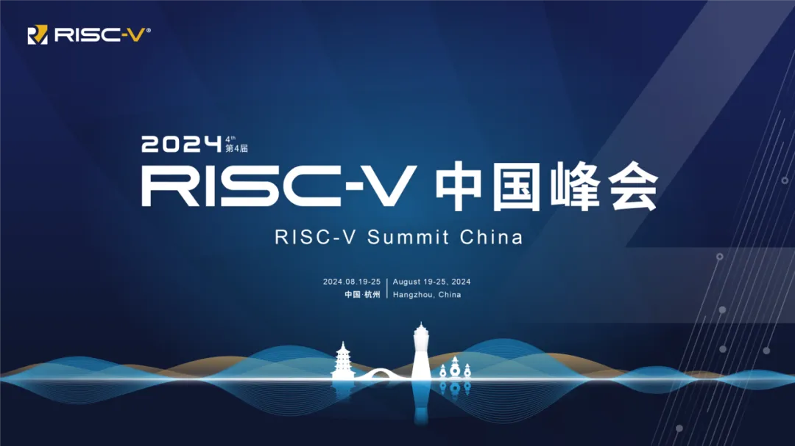

**2024 RISC-V中国峰会**
2024 RISC-V 中国峰会将于8月19日至25日在杭州黄龙饭店隆重举行。峰会采用“主会议+技术研讨会+展览展示+同期活动”的创新形式，将有超过20场同期活动在8月19日至25日期间同步进行。
RISC-V 中国峰会至今已成功举办四届，现已成为中国大陆规格最高、规模最大、影响力最强的专业会议之一。作为本届RISC-V中国峰会的同期活动，8月22日上午，达坦科技将举办第三届硬件敏捷开发与验证方法学研讨会。
在数字化转型浪潮的推动下，数字芯片作为信息技术的核心载体，其设计与验证的复杂度与日俱增，市场竞争亦趋于白热化。面对这一挑战，如何有效提升数字芯片的开发与验证效率，成为了摆在整个行业面前的重大课题。传统基于Verilog、SystemVerilog、VHDL及UVM的设计与验证方法虽已根深蒂固，但面对新时代的需求，其局限性日益凸显。

近年来，一股新兴力量正悄然改变着这一现状——以Chisel、SpinalHDL为代表的新一代硬件描述语言（HDL）以及Cocotb、pyuvm等新一代验证框架的崛起，为数字芯片的设计与验证领域注入了新的活力。这些新兴技术不仅在语法表达、代码简洁性及错误检查等方面展现出显著优势，更重要的是，它们为硬件敏捷设计与验证开辟了全新的路径，为业界带来了前所未有的灵活性和效率提升。

为了深入探讨这一领域的最新进展，促进技术交流与创新，本次研讨会特邀来自顶尖学术机构与科研前沿的几位专家，共同分享他们在硬件敏捷设计与验证方面的实践经验与前沿思考

## 活动信息
**活动时间：** 2024年8月22日，上午9:30-11:45

**活动地点**：杭州黄龙饭店 珍珠厅1

**观众报名链接：**

**第二届硬件敏捷开发与方法学研讨会 l 2023 RISC-V中国峰会同期活动顺利举办**

**达坦科技**始终致力于打造高性能 **Al+ Cloud 基础设施平台**，积极推动 AI 应用的落地。达坦科技通过**软硬件深度融合**的方式，提供高性能存储和高性能网络。为 AI 应用提供**弹性、便利、经济**的基础设施服务，以此满足不同行业客户对 AI+Cloud 的需求。

**公众号：** 达坦科技DatenLord

**DatenLord官网：** https://datenlord.github.io/zh-cn/

**知乎账号：** https://www.zhihu.com/org/da-tan-ke-ji

**B站：** https://space.bilibili.com/2017027518

**邮箱：** info@datenlord.com

如果您有兴趣加入**达坦科技Rust前沿技术交流群或硬件相关的群**  ，请添加**小助手微信**：DatenLord_Tech
