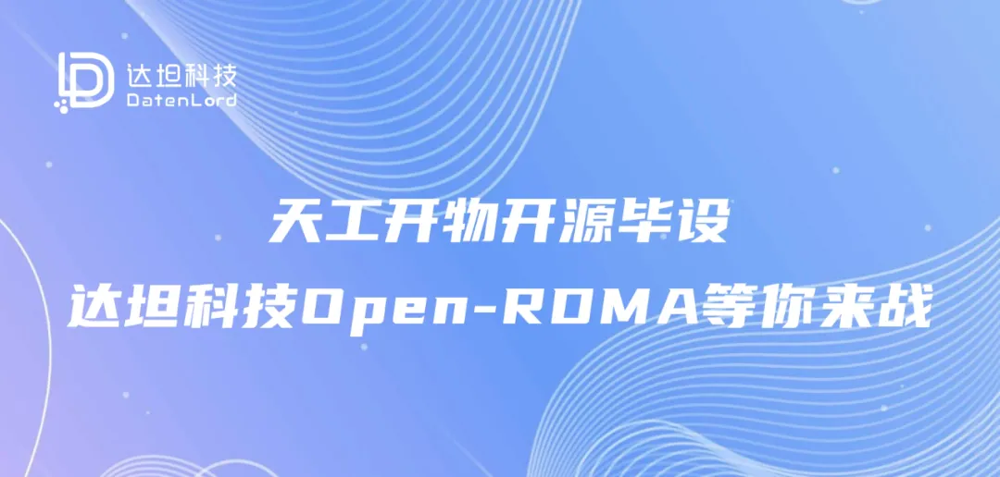
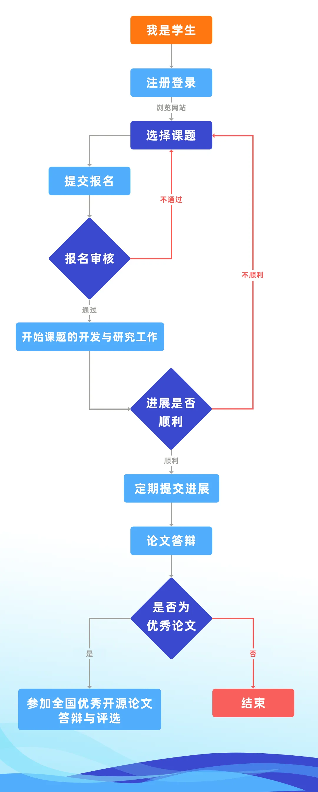
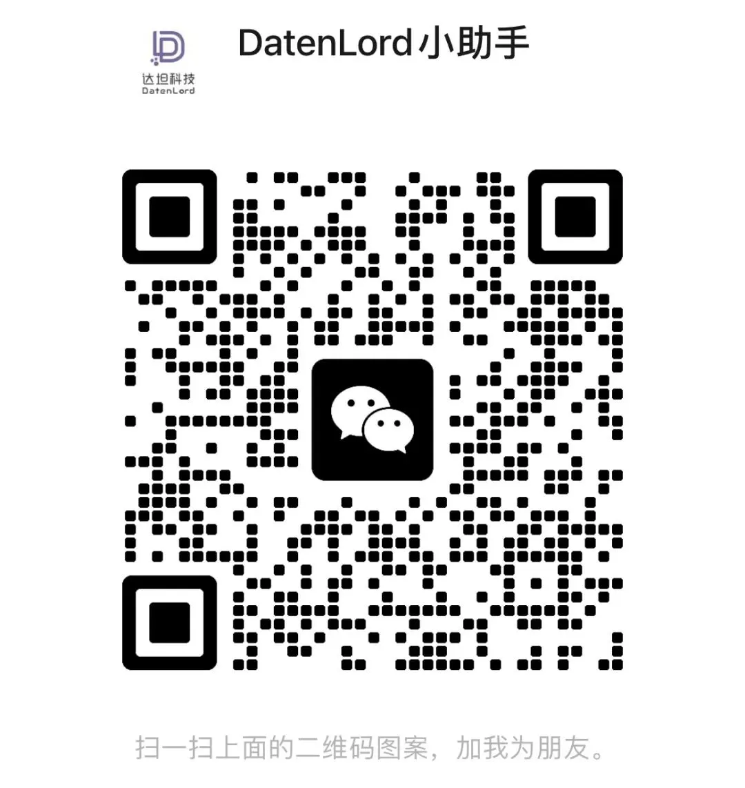

## 什么是天工开物开源毕设活动？
**天工开物开源创新实践毕业设计活动**（简称：开源毕设）是由**天工开物开源基金会**发起，并联合开源企业、开源社区、高校教师多方提供支持的一项面向高校学生的开源技术实践活动。**开源毕设**是一种结合开源社区实践和高等教育实践的创新模式，旨在通过参与真实的开源项目，为高校学生提供一个将理论知识应用于实践、培养创新思维和团队协作能力的平台，鼓励青年学子积极参与开源，为开源事业的发展贡献自己的力量。**达坦科技也基于我们的开源项目参与为学子们提供两个课题的辅导。**
## 达坦科技参与的开源项目是什么？
Open-RDMA 是达坦科技的一个开源的、基于 RoCE v2 协议扩展优化的软硬件实现套件。Open-RDMA 套件的核心部分是基于 RoCE v2 协议进行再次扩展优化后的软硬件实现，充分发挥软硬件协同设计开发的优势，通过硬件加速实现高吞吐低延迟，通过软件用户态协议栈实现集中管理且高度可配置的传输策略，从而实现在不同网络环境下都可以发挥极致性能。项目采用 Bluespec SystemVerilog、C 和 Rust 来实现硬件及软件逻辑，从而确保开源项目的正确性和可维护性。

在测试及验证方面，我们积极采用开源验证工具，同时也开发了自己的验证工具。Open-RDMA 套件通过 Bluesim、Cocotb 工具来进行RTL级别的验证，通过自研的 RoCE-Sim 工具进行协议数据包级别的验证，通过 Distro-Sim 工具进行软硬件联合仿真验证和调试。
##  达坦科技课题项目列表
### 导师：米明恒
毕业于哈尔滨工业大学，曾就职于多家大型互联网企业，有多年软硬件项目开发经验。目前就职于达坦科技，从事软硬件联合开发的相关工作，负责国产RDMA网卡的硬件RTL编写以及对应的软件驱动程序编写。熟悉C、Python、Rust等开发语言。
### 项目一：为国产开源RDMA网卡适配GPU

**开源项目名称: open-rdma**

**工作任务:**

为开源RDMA网卡blue-rdma编写对应的内核态及用户态驱动程序，从而使之能够支持对N卡或A卡显存进行访问的能力。

**对学生的能力要求:**

需要同时掌握Cpp、Rust，对RDMA有了解

**课题详细介绍：**

随着AI浪潮的到来，读写GPU显存成为了RDMA网卡必须支持的功能之一。本项目需要为开源RDMA网卡blue-rdma编写对应的内核态及用户态驱动程序，从而使之能够支持对N卡或A卡显存进行访问的能力。其中用户态驱动使用Rust开发，部分功能涉及到Linux Kernel开发以及C-FFI调用交互。
### 项目二：基于Python和SystemC的敏捷硬件验证框架
**开源项目名称: DistroSim**

**工作任务:**

对SystemC接口提供Python API封装，使得用户可以使用Python语言方便的开发硬件仿真模型。

**对学生的能力要求:**

需要同时掌握Cpp、Python、Rust

**课题详细介绍：**

敏捷验证需要验证人员可以高效开发硬件的行为级仿真模型。SystemC对硬件的行为级建模提供了良好的支持，但SystemC受众小，学习成本高。Python作为一个受众广泛的语言，更加适合作为硬件的行为级建模语言。
## 报名流程及链接
**报名链接：**
[https://edu.chancefoundation.org.cn/project-detail?id=150](https://edu.chancefoundation.org.cn/project-detail?id=150)
请点击课题名称右侧“**报名参加**”进行报名。

除了达坦科技的项目，目前开源毕设专题栏目已上线一百多个开源课题；即日起，全国高校学子均可访问天工开物开源教育联盟官方网站（https//edu.chancefoundation.org.cn）进行注册、报名。
这是一场汇聚青年才俊、共筑开源梦想的盛宴，活动诚邀全国高校的学子们，携手踏入这场技术的联欢，共同探索开源世界的无限可能！期待每一位热爱技术、勇于创新的你加入我们的行列，共同谱写开源新时代的篇章！

对于报名方式有任何疑问，或者对某一个课题非常感兴趣，并且想要深入了解的同学，欢迎扫码添加小助手微信：**DatenLord_Tech**，或发送邮件至info@datenlord.com
