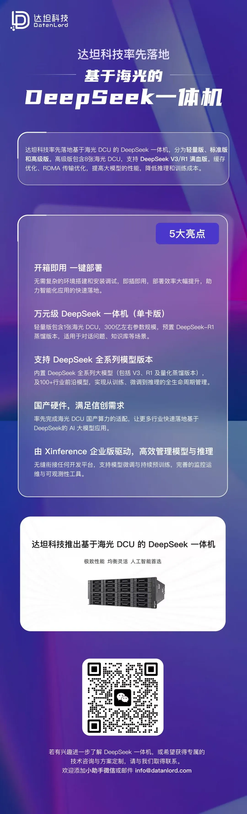
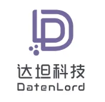

**达坦科技**始终致力于打造高性能 **Al+ Cloud 基础设施平台**，积极推动 AI 应用的落地。达坦科技通过**软硬件深度融合**的方式，提供高性能存储和高性能网络。为 AI 应用提供**弹性、便利、经济**的基础设施服务，以此满足不同行业客户对 AI+Cloud 的需求。

**公众号：** 达坦科技DatenLord

**DatenLord官网：** https://datenlord.github.io/zh-cn/

**知乎账号：** https://www.zhihu.com/org/da-tan-ke-ji

**B站：** https://space.bilibili.com/2017027518

**邮箱：** info@datenlord.com

如果您有兴趣加入**达坦科技Rust前沿技术交流群或硬件相关的群**  ，请添加**小助手微信**：DatenLord_Tech
