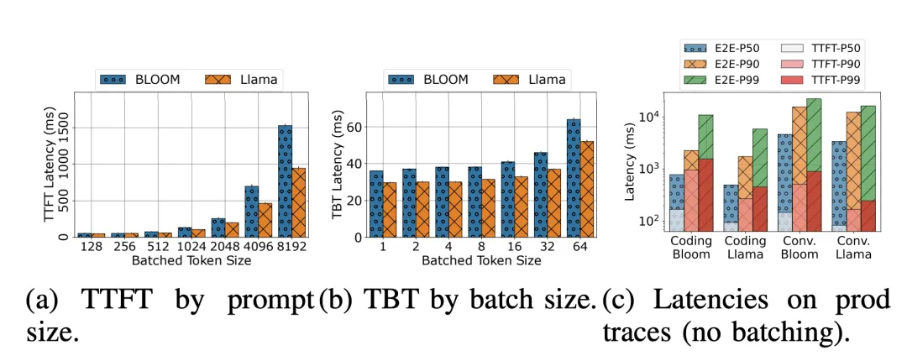
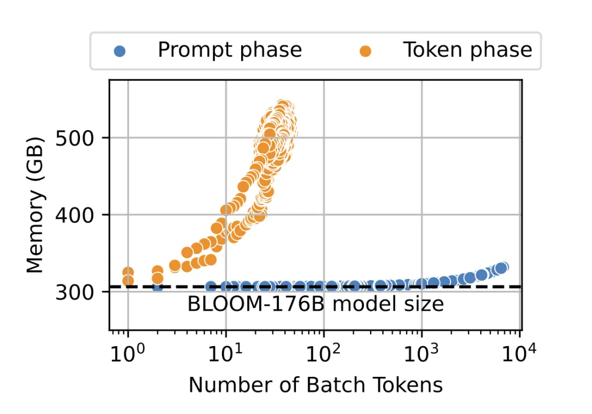
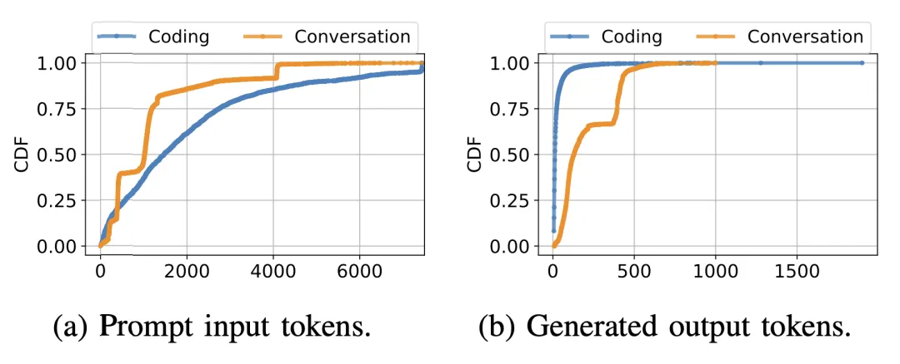
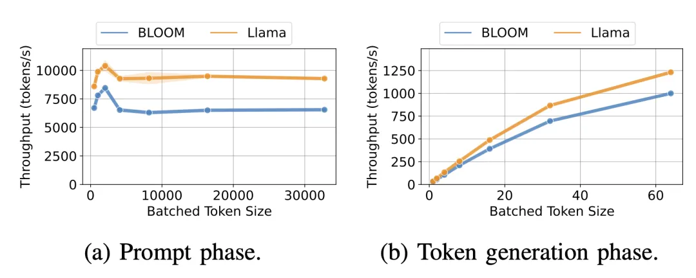
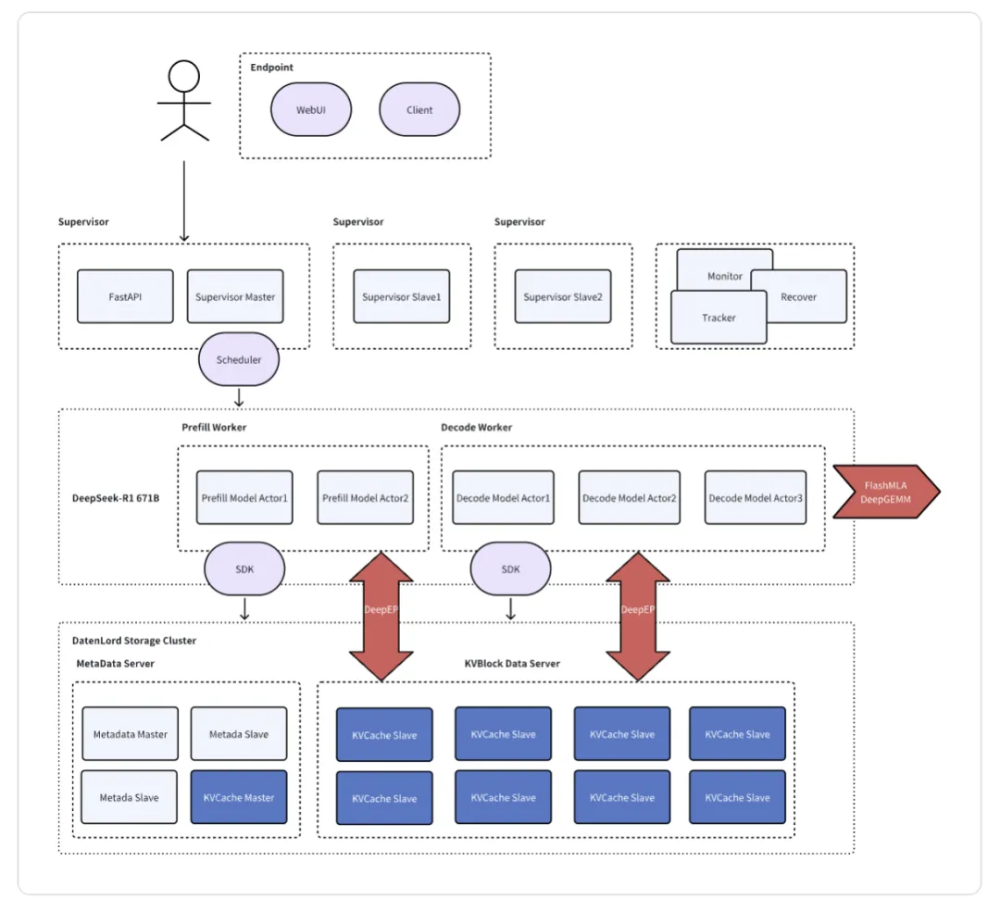
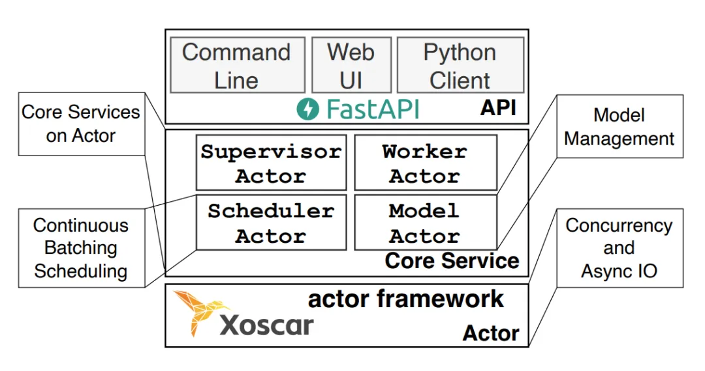

## 引言
随着人工智能技术的飞速发展，尤其是在大语言模型（LLM）的广泛应用下，如何提升大模型的推理效率成为了AI行业的一个关键问题。在诸多在线服务中，大型语言模型如DeepSeek R1等承担着对话生成、文本理解等多种任务，而这些任务的推理效率对用户体验和系统响应的性能至关重要。

业界常常使用一些指标来衡量系统的表现，其中包括TTFT（Total Time to First Token）和TPOT（Time Per Output Token）。这两个指标分别用于衡量从输入到生成第一个Token所需的时间，以及每生成一个Token所消耗的时间。在不同的应用场景中，降低TTFT和TPOT可以大幅提升用户体验，并降低系统的运营成本。

现有的在线推理服务中，大语言模型常常需要处理数十亿的参数（开源DeepSeek R1已达到671B），尤其在生成任务中，模型需要为每一个新生成的Token重新计算大量的中间结果。每一次计算，不仅消耗着庞大的计算资源，而且直接影响了系统的响应速度。

为了有效提升大模型的推理效率，Infra领域引入KVCache（Key-Value Cache）技术，以减少重复计算带来的性能瓶颈。KVCache技术可以将推理过程中间计算结果进行缓存，避免在生成新Token时重复计算先前的结果，从而减少了算力资源的消耗，并显著降低了用户响应延迟。

现有开源工程（vLLM，SGLang等）在此基础上，针对KVCache和批量推理进一步优化，在单机推理上取得极高的吞吐量。但是针对真实的异构集群场景下，高效利用推理引擎和跨节点KVCache共享来提高集群吞吐量依然是一个亟待解决的挑战。

本文将详细探讨Xinference与DatenLord如何通过创新的设计方案，在异构环境下实现大模型的分离式推理，并进一步提升KVCache技术的效率，从而解决传统单机推理框架中的瓶颈问题。

## 背景知识
在深入了解Xinference和DatenLord的设计方案之前，需要对生成类大模型的推理过程有一个清晰的认知。生成类大模型实现高效推理通常包括多个计算阶段和组件，涵盖了从模型接收输入到最终生成文本的全过程，本设计的核心内容包括：

Xinferene推理引擎：

Xorbits Inference（Xinference）是一款强大且多用途的高性能推理框架，专为语言、语音识别和多模态模型的部署与服务而设计。用户只需一条命令即可轻松运行自定义或内置的前沿 AI 模型。无论是研究人员、开发者还是数据科学家，Xorbits Inference 都能帮助高效利用先进的人工智能技术。

DatenLord分布式存储：

DatenLord 是一个高性能的云原生分布式存储平台，专为微服务、人工智能和无服务器等应用优化。它具备分布式、容错和优雅升级等云原生特性，便于维护和使用。通过采用 NVMe、非易失性内存和异步编程等技术，DatenLord 为数据库、机器学习和大数据等关键应用提供卓越的存储性能。

Prefill 推理：

Prefill阶段是推理过程的起始阶段，主要任务是对输入的上下文进行编码，初始化模型的计算状态。在这一阶段，模型根据输入的文本或上下文进行复杂的矩阵运算，生成一组初始的特征表示。此阶段的计算通常涉及到较大的计算资源需求，并且会生成大量的中间结果。

Decode 推理：

Decode阶段是生成模型的核心阶段，模型通过不断地解码当前的上下文信息来生成下一个Token。在这个过程中，模型依赖于之前生成的Token，并不断更新上下文信息以生成新的内容。每生成一个Token，模型都会对当前的上下文进行一次推理，这要求模型能够高效地处理大量的参数并进行快速计算。此阶段的计算在长上下文的场景下会涉及到较大的IO需求，并且会频繁更新KVCache的计算结果。

KVCache：

为了提高推理效率，尤其是在生成任务中经常涉及到上下文重复的场景，KVCache技术应运而生。KVCache会缓存模型推理过程中产生的中间计算结果（例如键值对），使得模型可以在后续生成过程中复用这些计算结果，从而避免重复计算。这种缓存技术显著减少了计算量，并提升了推理效率。

在这些阶段中，Prefill和Decode阶段对计算资源的需求是非常大的，尤其是内存带宽和计算能力。而KVCache技术则通过缓存中间结果，解决了重复计算带来的效率问题，特别是在长文本生成和对话系统中，能够显著提升响应速度。

## 现有瓶颈
PD（Prefill-Decoding）混合部署的设计面临着一系列挑战，特别是在需要满足服务质量要求的情况下。以下是针对该设计中存在问题的详细分析。

SLO要求下的大模型混合推理挑战

预填充和解码操作之间的干扰是PD混合部署中的主要问题之一。在当前的部署模式中，批处理预填充和解码任务以提高整体吞吐量，但这种做法会导致严重的干扰，尤其是在处理有严格SLO（服务级别目标）的请求时。具体而言，解码任务必须等待预填充作业完成，这直接增加了TTFT（首次令牌传输时间）和TPOT（所有令牌传输时间）。随着预填充阶段的延长，解码任务的等待时间也显著增加，从而影响整个系统的性能。尤其是在GPU负载较高时，解码任务的延迟可能更为严重，导致服务质量无法得到有效保障，如图1所示。

图1 Splitwise中TTFT和E2E（TPOT的累计值）测试

Prefill和Decode的资源利用瓶颈
预填充和解码任务共享相同的GPU资源，这使得两者的并行度和资源分配受到严重限制。预填充阶段通常需要更多的GPU并行度来满足低TTFT的要求，而解码阶段则可以在较低的并行度下高效运行，但它对内存的需求较高。当两者被强行合并在同一个GPU上执行时，往往会导致资源的过度配置，进而增加了成本和复杂性。因此，现有系统无法灵活调整资源和并行度，以最佳方式服务于预填充和解码任务，常常导致计算资源的浪费，如图2所示。

图2 Splitwise 在Prefill和Decode上的内存需求

混合推理调度算法受限
1. Prefill阶段算力是瓶颈，Decode阶段内存是瓶颈

在LLM模型的执行过程中，Prefill阶段和Decode阶段对资源的需求是不同的，如图3所示。Prefill阶段主要负责加载和处理Prompt，在这一阶段，算力是瓶颈。具体来说，随着Batch size的增大，计算负载增加，但如果Batch size过大，算力可能无法充分利用，导致性能下降。因此，Prefill阶段的性能主要受限于计算资源，且Batch size需要适当限制，以确保算力能够达到最优的利用效率。

而在Decode阶段（Token generation阶段），内存成为瓶颈。在此阶段，生成token的过程对内存需求急剧增大。随着生成的token数量增多，内存使用量急剧上升。因此，Decode阶段的性能瓶颈更多是由于内存限制，而不是算力。

图3 Splitwise 中Prefill和Decode随token数量的推理性能分布

2. Prefill阶段应该限制Batch size从而避免影响性能，相反，Decode阶段应该增大Batch size来获得更高的吞吐

在Prefill阶段，由于算力是瓶颈，Batch size过大时，算力负载可能超过设备的承载能力，导致计算资源无法有效利用，从而降低吞吐率。因此，为了确保Prefill阶段的最佳性能，应当限制Batch size。

然而，在Decode阶段，由于内存是瓶颈，增大Batch size有助于提高吞吐量。内存资源能够支持更大的Batch size，而不会像Prefill阶段那样因算力受限而导致性能下降。因此，Decode阶段适合使用较大的Batch size以提高整体吞吐，如图4所示。

图4 Splitwise 中batch推理在Prefill和Decode的延迟测试

3. Prefill阶段能充分使用算力，Decode阶段不能

通过对Prefill和Decode阶段的功耗分析，可以得出一个结论：Prefill阶段可以充分利用算力，最大化性能。这是因为在Prefill阶段，算力负载较高，且设备的计算资源得到了较为充分的使用。而在Decode阶段，虽然内存负载较重，但算力的使用效率较低，设备无法充分发挥算力，如图5所示。

图5 Splitwise中Prefill和Decode对算力利用情况（Batch能力）

## Xinference设计方案
为了有效解决这些问题，分离式部署是解决以上资源和SLO需求的最优解决方案。通过将Prefill和Decode任务分配到不同的GPU上，可以避免两个阶段之间的干扰，并且每个阶段可以根据其特定的计算需求进行资源优化，此外本方案适配deepseek-ai开源的高性能通信库DeepEP加速KVCache传输以及在海光DCU上的FlashMLA/DeepGEMM算子加速通用计算速度，从而最大化GPU的利用率，整体系统如图6所示。

图6 Xinference PD分离整体架构

Xinference现有架构
在当今的AI模型服务中，性能和资源管理始终是重中之重。Xinference作为一款领先的大模型推理引擎，其架构主要由API、Core Service以及Actor三个核心部分组成，如图7所示。

图7 Xinference架构

首先，API层以FastAPI为基础，提供给用户直观易用的RESTful接口，用户可轻松地与推理系统进行交互。进一步深入至Core Service层，Xinference引入了自主研发的Xoscar框架，这一框架极大简化了低层次的并发管理、设备调度与通信任务，如图8所示。

图8 高性能Xoscar架构

在此基础上，Supervisor负责统筹整体调度、资源管理和任务分配，确保系统资源的最佳分配。WorkerActor则更加细化地管理具体的计算设备与模型实例，实现对资源的精细化控制。

最核心的Actor层，由ModelActor组成，这些模型实例分布在ActorPool中，每个实例负责加载并执行特定的模型任务。此外，Xinference充分利用Continuous Batching技术与异步IO，进一步提高了模型推理过程中的吞吐量与效率。

为提高DeepSeek模型的计算能力，在Actor Executor中引入FlashMLA与DeepGEMM算子提高Prefill阶段的计算能力（以及特别优化FlashMLA内核以支持国产海光DCU），以及在FP8场景下，显著提高Hopper GPU的推理性能。

Datenlord KVCache存储方案
DatenLord 是下一代云原生分布式存储平台，旨在满足微服务、无服务器、人工智能等下一代云原生应用对性能要求极高的存储需求，其中针对Cache的设计如图9所示。

图9 DatenLord 分布式Cache的整体架构

为了满足异构环境下的高效缓存需求，DatenLord专门设计了一种创新的KV Cache存储机制。通过精心设计的KV Block结构，统一使用固定的Block进行缓存，以减少数据传输次数，以及减少内存碎片。

在缓存组织形式上，DatenLord采用了通用且高效的RadixTree索引，这种数据结构能够快速定位缓存数据的位置，减少检索延迟。在本地缓存（Local Cache）层面，系统设计了两级缓存策略，分别为高频交互的active cache和历史数据缓存history cache。这种分级管理策略能更有效地平衡新旧数据的存储与淘汰，特别适合Prefill和Decode阶段缓存访问模式的差异。

在分布式缓存的设计中，采用了单一master节点统一管理集群内索引数据。此外，通过batch insert技术批量更新索引，进一步优化了缓存插入效率。针对冷数据和热数据设计了多级Radix索引树，在缓存利用上实现冷热分离。

为降低Xinference推理引擎和DatenLord之间读写KVBlock之间的开销，DatenLord也将DeepEP提供的高吞吐量、低延迟的全向GPU内核优化的RDMA传输方案引入进来，以减少CPU waiting的影响，并且在Layer-wise完成KVBlock流水线传输以利用好推理能力。

PD分离设计
PD分离式推理（Prefill与Decode分离）作为一种有效提升资源利用率和性能的技术，已逐渐成为大模型推理的重要趋势。Xinference的PD分离设计将vLLM等通用模型推理过程中的Prefill和Decode两个阶段独立部署，并且通过DatenLord存储组件管理计算的中间产物，以达到资源利用和吞吐最大化，如图6所示。

在推理实例上，每个WorkerActor被标记了明确的Prefill或Decode角色，从而帮助调度器识别并且调整GPU资源的分配与使用。在实际运行中，Prefill任务通常要求更大的GPU并行能力，以更快地完成模型初始状态的推理；而Decode任务相对轻量，更适合快速响应频繁的后续推理请求，充分复用Prefill阶段的计算成果，两者之间的交互通过统一的DatenLord Storage组件来交互。

Supervisor作为整体调度中心，动态为API请求分配PDActor管理实体，调整最优的Prefill和Decode的后端推理实例的部署情况。通过动态观测系统内Prefill和Decode的负载，Supervisor能及时协调并切换Prefill与Decode的最优，确保系统负载稳定和提高整体推理性能。

为确保PD分离部署的高效性与稳定性，系统设计了统一的异常处理机制，由Supervisor统一响应异常和任务终止请求，能够及时恢复或重试，防止任务的死锁或异常中断。

## 结论
本篇文章详细探讨了大语言模型推理效率提升的核心技术，特别是KVCache技术及其在异构环境下的应用。在分析了现有技术瓶颈的基础上，Xinference提出了通过分离式推理架构以及优化缓存技术来解决这些问题的方法。Xinference与DatenLord的设计方案展示了在分布式环境中提升推理性能的可行性，尤其是在高效利用推理引擎和跨节点KVCache共享方面取得的显著进展。

然而，本文所涉及的只是大模型推理优化的第一部分，后续本文将继续深入探讨以下几个方面：

跨节点推理的进一步优化：针对异构集群环境中大规模推理的效率瓶颈，将在后续讨论如何通过创新的推理调度策略和资源管理进一步提升集群吞吐量和响应速度。

实验与性能验证：下一部分将展示在不同硬件环境下的性能评测结果，验证Xinference PD分离方案的优势，并为实际应用提供参考。

敬请关注后续内容，更多细节将在接下来的文章中揭晓。

参考文献
1. https://aclanthology.org/2024.emnlp-demo.30.pdf
2. https://github.com/xorbitsai/inference
3. https://github.com/datenlord/datenlord
4. Xavier https://github.com/xorbitsai/inference/pull/2732
5. Splitwise https://arxiv.org/abs/2311.18677
6. Distserve https://arxiv.org/abs/2401.09670

**达坦科技**始终致力于打造高性能 **Al+ Cloud 基础设施平台**，积极推动 AI 应用的落地。达坦科技通过**软硬件深度融合**的方式，提供高性能存储和高性能网络。为 AI 应用提供**弹性、便利、经济**的基础设施服务，以此满足不同行业客户对 AI+Cloud 的需求。

**公众号：** 达坦科技DatenLord

**DatenLord官网：** https://datenlord.github.io/zh-cn/

**知乎账号：** https://www.zhihu.com/org/da-tan-ke-ji

**B站：** https://space.bilibili.com/2017027518

**邮箱：** info@datenlord.com

如果您有兴趣加入**达坦科技Rust前沿技术交流群或硬件相关的群**  ，请添加**小助手微信**：DatenLord_Tech
