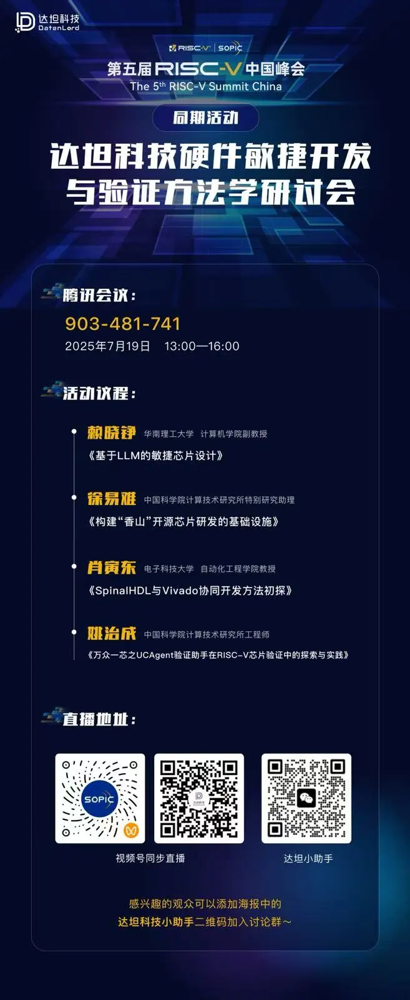
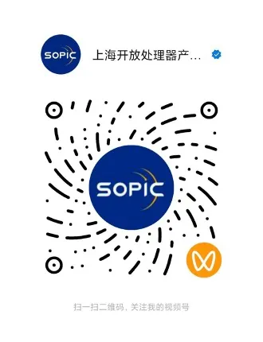

## 第五届RISC-V中国峰会  2025 RISC-V
2025年，全球开源芯片开放架构技术的盛会——第五届RISC-V中国峰会将于7月16日至19日上海张江科学会堂盛大召开。本届中国峰会将聚焦人工智能、高性能计算、汽车电子、软件与生态系统、教育与人才培养、前沿技术创新、EDA、投资与并购等九大热门话题，采用“主论坛+专题研讨+生态展览+开发者活动”的多元形式，汇聚全球顶尖专家、企业领袖及开发者，共同探索RISC-V技术的前沿进展与产业落地。

作为中国RISC-V领域最具影响力的行业峰会，RISC-V中国峰会已连续五年推动开源芯片生态的繁荣发展。2025年，峰会规模进一步升级，预计将多场技术分论坛及同期活动，其中，作为本届RISC-V中国峰会的同期活动的主办方，达坦科技将于7月19日下午一点至四点，举办第四届“敏捷硬件开发与验证方法学”研讨会。

## 敏捷硬件开发研学会
在数字化转型浪潮的持续推动下，数字芯片作为信息技术的核心基石，其设计与验证的复杂度持续攀升，市场竞争也日趋白热化。如何有效提升芯片开发与验证效率，已成为整个行业亟待突破的关键问题。

尽管以 Verilog、SystemVerilog、VHDL 和 UVM 为代表的传统方法在工业界应用广泛，体系成熟，但面对日益增长的复杂性与敏捷开发的需求，其局限性也逐步显现。与此同时，以 Chisel、SpinalHDL 为代表的新一代硬件描述语言，以及 Cocotb、pyuvm 等验证框架迅速崛起，在语法简洁性、错误定位、代码可重用性等方面展现出显著优势，为硬件的敏捷开发与验证开辟了全新路径。

在此背景下，本次研讨会将围绕“敏捷芯片开发”的核心主题，聚焦新一代工具链与开源生态的融合应用，邀请来自学术界与产业前沿的多位专家展开深入交流。

演讲主题包括：

1. 
标题：《基于LLM的敏捷芯片设计》

演讲者：赖晓铮 华南理工大学，计算机学院副教授

简介：探索大语言模型（LLM）如何赋能芯片设计流程，重构开发范式，实现从代码生成到设计验证的全流程智能化。

2. 
标题：《构建“香山”开源芯片研发的基础设施》

演讲者：徐易难 中国科学院计算技术研究所特别研究助理

简介：聚焦国产自主研发“香山”芯片背后的支撑平台建设，探讨开源芯片如何走向规模化协作与工程落地。

3. 
标题：《SpinalHDL与Vivado协同开发方法初探》

演讲者：肖寅东 电子科技大学，自动化工程学院教授

简介：介绍如何在传统EDA工具（如Vivado）环境下，灵活运用SpinalHDL实现高效协同设计，提升生产力与验证效率。

4. 
标题：《万众一芯之UCAgent验证助手在RISC-V芯片验证中的探索与实践》

演讲者：姚治成 中国科学院计算技术研究所工程师

简介：分享RISC-V芯片开发过程中的验证挑战，及UCAgent在构建灵活验证环境中的应用与思考。

本次研讨会旨在推动从语言工具、验证框架到开源生态的全面对话，激发技术交流与协作创新，共同探索芯片设计与验证的新路径、新方法、新范式。

## 活动信息
活动时间：7月19日下午13:00-16:00

腾讯会议号码：903-481-741

直播观看链接：

**达坦科技**始终致力于打造高性能 **Al+ Cloud 基础设施平台**，积极推动 AI 应用的落地。达坦科技通过**软硬件深度融合**的方式，提供高性能存储和高性能网络。为 AI 应用提供**弹性、便利、经济**的基础设施服务，以此满足不同行业客户对 AI+Cloud 的需求。

**公众号：** 达坦科技DatenLord

**DatenLord官网：** https://datenlord.github.io/zh-cn/

**知乎账号：** https://www.zhihu.com/org/da-tan-ke-ji

**B站：** https://space.bilibili.com/2017027518

**邮箱：** info@datenlord.com

如果您有兴趣加入**达坦科技Rust前沿技术交流群或硬件相关的群**  ，请添加**小助手微信**：DatenLord_Tech
