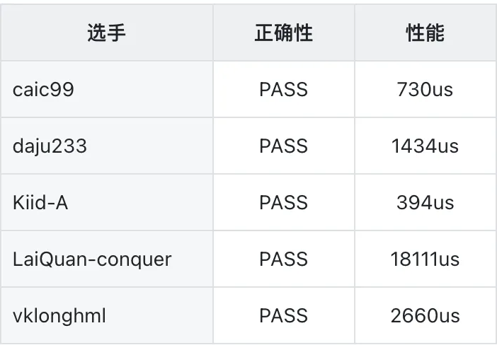

亲爱的参赛选手与关注朋友们：


历时数周的激烈角逐，2025 DatenLord GPU 性能优化大赛已圆满落幕！本次大赛吸引了来自全国众多高校学生与开发者的积极参与，涌现了大量优秀的GPU内核优化方案，展现了大家在高性能计算领域的深厚功底与创新思维。


经过严格的性能测试与代码评审，现将最终比赛结果公示如下：

## 开源代码公示

所有进入终评的参赛代码已按照开源协议公开在 GitHub 仓库中，供社区学习、参考与验证：


仓库地址（点击文末 “阅读原文” 跳转）
https://github.com/datenlord/gpu-camp-2025


该仓库包含了各选手最终提交的优化内核源码、构建说明与测试用例。我们鼓励大家查阅优秀作品，相互学习，共同推动 GPU 高性能计算生态的发展。


本次结果公示期为3天（即12月11至13日），自本文发布之日起计算。


在公示期间，如对结果有疑问、发现数据问题或对代码 originality 存疑，请通过以下方式联系我们：
邮箱：info@datenlord.com
请在邮件标题注明【GPU大赛结果反馈】并提供详细说明。


我们将在公示期结束后最终确认获奖名单，并安排奖项发放与证书制作。


## 大赛回顾与致谢
本次大赛围绕 GPU 内核性能优化展开，涵盖多个实战场景。我们欣喜地看到，不少作品不仅在性能上实现显著提升，更在代码可维护性、架构通用性上表现出色。


感谢所有参赛者的智慧付出与持续投入！也感谢本次大赛的合作单位、评审专家与社区志愿者的大力支持。正是因为你们的参与，让这场比赛成为一场高质量的技术交流盛会。

## DatenLord持续招聘

比赛结束，但对极致性能的追求永不止步！


DatenLord 正在积极构建高性能AI+Cloud基础设施平台，现开放AI Infra实习生 岗位招募！


工作内容：

负责在国产GPU加速卡上进行大模型的适配、移植工作。

负责使用类CUDA语言或Triton编写算子以完成模型的适配、移植。

负责优化大模型的分布式推理架构，对部署集群进行性能测试与调优的迭代改进。


岗位要求：

深入掌握以Deepseek为代表的大语言模型的推理流程实现细节。

熟练掌握CUDA或Triton语言，可独立完成算子的开发移植工作。

熟练掌握GPU上的性能测试、调优工作。

深入掌握大模型中的各种并行算法。


📮 如何申请？
欢迎点击文章 【AI与高性能网络领域】一大波线上线下实习向你袭来！，跳转至我们的官方招聘页面，查看完整的职位详情与申请流程。

## 测试结果

#### 大赛结果



````
# caic99
kernel(unsignedintconst*, __half const*, __half const*, __half const*, float*, int, int)
# default
kernel(charconst*, __half const*, float*, int, int)
````

测试方法是把参赛选手提供代码中的gemv_main.cpp和gemv_kernels.h替换到工程实例项目中，而后运行./quick_build.sh，./gemv_test和python performance_test.py

以下是五位得分最高选手的结果：

#### 1 caic99 
正确性测试：

````
Testing kernel:gemv_1x7168_7168x9216(7168x9216)
Result:PASS(MaxError:0.00037384)
Testing kernel:gemv_1x7168_7168x1536(7168x1536)
Result:PASS(MaxError:7.24792e-05)
Testing kernel:gemv_1x7168_7168x1024(7168x1024)
Result:PASS(MaxError:5.34058e-05)
Testing kernel:gemv_1x5120_5120x6144(5120x6144)
Result:PASS(MaxError:0.000228882)
Testing kernel:gemv_1x5120_5120x3584(5120x3584)
Result:PASS(MaxError:0.000160217)
Testing kernel:gemv_1x5120_5120x3072(5120x3072)
Result:PASS(MaxError:0.000125885)
Testing kernel:gemv_1x5120_5120x768(5120x768)
Result:PASS(MaxError:3.24249e-05)
Testing kernel:gemv_1x5120_5120x256(5120x256)
Result:PASS(MaxError:9.53674e-06)
Testing kernel:gemv_1x4608_4608x7168(4608x7168)
Result:PASS(MaxError:0.000389099)
Testing kernel:gemv_1x4096_4096x7168(4096x7168)
Result:PASS(MaxError:0.000259399)
Testing kernel:gemv_1x3072_3072x5120(3072x5120)
Result:PASS(MaxError:0.000167847)
Testing kernel:gemv_1x1536_1536x6144(1536x6144)
Result:PASS(MaxError:0.000255585)
Testing kernel:gemv_1x512_512x7168(512x7168)
Result:PASS(MaxError:0.000244141)
Testing kernel:gemv_1x384_384x5120(384x5120)
Result:PASS(MaxError:0.000133514)
````

性能测试：

````
HIP GEMV Kernel Performance Results
==================================================
gemv_1x1536_1536x6144(unsigned intconst*, __half const*, __half const*, __half const*, float*, int, int): 33us
gemv_1x3072_3072x5120(unsigned intconst*, __half const*, __half const*, __half const*, float*, int, int): 43 us
gemv_1x384_384x5120(unsigned intconst*, __half const*, __half const*, __half const*, float*, int, int): 22 us
gemv_1x4096_4096x7168(unsigned intconst*, __half const*, __half const*, __half const*, float*, int, int): 70 us
gemv_1x4608_4608x7168(unsigned intconst*, __half const*, __half const*, __half const*, float*, int, int): 77 us
gemv_1x5120_5120x256(unsigned intconst*, __half const*, __half const*, __half const*, float*, int, int): 24 us
gemv_1x5120_5120x3072(unsigned intconst*, __half const*, __half const*, __half const*, float*, int, int): 59 us
gemv_1x5120_5120x3584(unsigned intconst*, __half const*, __half const*, __half const*, float*, int, int): 60 us
gemv_1x5120_5120x6144(unsigned intconst*, __half const*, __half const*, __half const*, float*, int, int): 84 us
gemv_1x5120_5120x768(unsigned intconst*, __half const*, __half const*, __half const*, float*, int, int): 21 us
gemv_1x512_512x7168(unsigned intconst*, __half const*, __half const*, __half const*, float*, int, int): 28 us
gemv_1x7168_7168x1024(unsigned intconst*, __half const*, __half const*, __half const*, float*, int, int): 37 us
gemv_1x7168_7168x1536(unsigned intconst*, __half const*, __half const*, __half const*, float*, int, int): 35 us
gemv_1x7168_7168x9216(unsigned intconst*, __half const*, __half const*, __half const*, float*, int, int): 136 us
--------------------------------------------------
TOTAL EXECUTION TIME: 730 us
````

#### 2 daju233
正确性测试：

````
Testing kernel:gemv_1x7168_7168x9216(7168x9216)
Result:PASS(max_error=0.000442505,max_relative_error=0.0484345)
Testing kernel:gemv_1x7168_7168x1536(7168x1536)
Result:PASS(max_error=0.000263214,max_relative_error=0.00104131)
Testing kernel:gemv_1x7168_7168x1024(7168x1024)
Result:PASS(max_error=0.000228882,max_relative_error=0.0003601)
Testing kernel:gemv_1x5120_5120x6144(5120x6144)
Result:PASS(max_error=0.000236511,max_relative_error=0.0105049)
Testing kernel:gemv_1x5120_5120x3584(5120x3584)
Result:PASS(max_error=0.000244141,max_relative_error=0.0048729)
Testing kernel:gemv_1x5120_5120x3072(5120x3072)
Result:PASS(max_error=0.000156403,max_relative_error=0.00402056)
Testing kernel:gemv_1x5120_5120x768(5120x768)
Result:PASS(max_error=0.000171661,max_relative_error=8.5322e-05)
Testing kernel:gemv_1x5120_5120x256(5120x256)
Result:PASS(max_error=0.000115395,max_relative_error=0.000141215)
Testing kernel:gemv_1x4608_4608x7168(4608x7168)
Result:PASS(max_error=0.000228882,max_relative_error=0.0045323)
Testing kernel:gemv_1x4096_4096x7168(4096x7168)
Result:PASS(max_error=0.000190735,max_relative_error=0.00236407)
Testing kernel:gemv_1x3072_3072x5120(3072x5120)
Result:PASS(max_error=0.000160217,max_relative_error=0.000764705)
Testing kernel:gemv_1x1536_1536x6144(1536x6144)
Result:PASS(max_error=6.86646e-05,max_relative_error=0.0017174)
Testing kernel:gemv_1x512_512x7168(512x7168)
Result:PASS(max_error=1.90735e-05,max_relative_error=0.00294406)
Testing kernel:gemv_1x384_384x5120(384x5120)
Result:PASS(max_error=1.43051e-05,max_relative_error=0.000275999)
````

性能测试：

````
HIP GEMV Kernel Performance Results
==================================================
gemv_1x1536_1536x6144(charconst*, __half const*, float*, int, int): 97us
gemv_1x3072_3072x5120(charconst*, __half const*, float*, int, int): 84 us
gemv_1x384_384x5120(charconst*, __half const*, float*, int, int): 17 us
gemv_1x4096_4096x7168(charconst*, __half const*, float*, int, int): 153 us
gemv_1x4608_4608x7168(charconst*, __half const*, float*, int, int): 174 us
gemv_1x5120_5120x256(charconst*, __half const*, float*, int, int): 41 us
gemv_1x5120_5120x3072(charconst*, __half const*, float*, int, int): 91 us
gemv_1x5120_5120x3584(charconst*, __half const*, float*, int, int): 98 us
gemv_1x5120_5120x6144(charconst*, __half const*, float*, int, int): 167 us
gemv_1x5120_5120x768(charconst*, __half const*, float*, int, int): 44 us
gemv_1x512_512x7168(charconst*, __half const*, float*, int, int): 26 us
gemv_1x7168_7168x1024(charconst*, __half const*, float*, int, int): 63 us
gemv_1x7168_7168x1536(charconst*, __half const*, float*, int, int): 68 us
gemv_1x7168_7168x9216(charconst*, __half const*, float*, int, int): 310 us
--------------------------------------------------
TOTAL EXECUTION TIME: 1434 us
````

#### 3 Kiid-A
正确性测试：

````
Testing kernel:gemv_1x7168_7168x9216(7168x9216)
Result:PASS(max_error=0.000328064,max_relative_error=0.0158571)
Testing kernel:gemv_1x7168_7168x1536(7168x1536)
Result:PASS(max_error=0.000305176,max_relative_error=0.00164788)
Testing kernel:gemv_1x7168_7168x1024(7168x1024)
Result:PASS(max_error=0.000198364,max_relative_error=0.00169997)
Testing kernel:gemv_1x5120_5120x6144(5120x6144)
Result:PASS(max_error=0.000175476,max_relative_error=0.117269)
Testing kernel:gemv_1x5120_5120x3584(5120x3584)
Result:PASS(max_error=0.000289917,max_relative_error=0.000514797)
Testing kernel:gemv_1x5120_5120x3072(5120x3072)
Result:PASS(max_error=0.000230789,max_relative_error=0.00165724)
Testing kernel:gemv_1x5120_5120x768(5120x768)
Result:PASS(max_error=0.000202179,max_relative_error=0.000266583)
Testing kernel:gemv_1x5120_5120x256(5120x256)
Result:PASS(max_error=0.000144958,max_relative_error=6.19709e-05)
Testing kernel:gemv_1x4608_4608x7168(4608x7168)
Result:PASS(max_error=0.000305176,max_relative_error=0.0303064)
Testing kernel:gemv_1x4096_4096x7168(4096x7168)
Result:PASS(max_error=0.000175476,max_relative_error=0.00390801)
Testing kernel:gemv_1x3072_3072x5120(3072x5120)
Result:PASS(max_error=0.00012207,max_relative_error=0.194103)
Testing kernel:gemv_1x1536_1536x6144(1536x6144)
Result:PASS(max_error=6.29425e-05,max_relative_error=0.0034573)
Testing kernel:gemv_1x512_512x7168(512x7168)
Result:PASS(max_error=2.09808e-05,max_relative_error=0.0188714)
Testing kernel:gemv_1x384_384x5120(384x5120)
Result:PASS(max_error=1.52588e-05,max_relative_error=0.0285714)
````

性能测试：

````
HIP GEMV Kernel Performance Results
==================================================
gemv_1x1536_1536x6144(charconst*, __half const*, float*, int, int): 23us
gemv_1x3072_3072x5120(charconst*, __half const*, float*, int, int): 30 us
gemv_1x384_384x5120(charconst*, __half const*, float*, int, int): 9 us
gemv_1x4096_4096x7168(charconst*, __half const*, float*, int, int): 35 us
gemv_1x4608_4608x7168(charconst*, __half const*, float*, int, int): 39 us
gemv_1x5120_5120x256(charconst*, __half const*, float*, int, int): 19 us
gemv_1x5120_5120x3072(charconst*, __half const*, float*, int, int): 24 us
gemv_1x5120_5120x3584(charconst*, __half const*, float*, int, int): 25 us
gemv_1x5120_5120x6144(charconst*, __half const*, float*, int, int): 37 us
gemv_1x5120_5120x768(charconst*, __half const*, float*, int, int): 20 us
gemv_1x512_512x7168(charconst*, __half const*, float*, int, int): 11 us
gemv_1x7168_7168x1024(charconst*, __half const*, float*, int, int): 23 us
gemv_1x7168_7168x1536(charconst*, __half const*, float*, int, int): 25 us
gemv_1x7168_7168x9216(charconst*, __half const*, float*, int, int): 75 us
--------------------------------------------------
TOTAL EXECUTION TIME: 394 us
````

#### 4 LaiQuan-conquer 

正确性测试：

````
Testing kernel:gemv_1x7168_7168x9216(7168x9216)
Result:PASS(max_error=1.52588e-05,max_relative_error=0.000955252)
Testing kernel:gemv_1x7168_7168x1536(7168x1536)
Result:PASS(max_error=1.52588e-05,max_relative_error=9.75097e-06)
Testing kernel:gemv_1x7168_7168x1024(7168x1024)
Result:PASS(max_error=1.52588e-05,max_relative_error=1.10606e-05)
Testing kernel:gemv_1x5120_5120x6144(5120x6144)
Result:PASS(max_error=1.52588e-05,max_relative_error=8.30247e-05)
Testing kernel:gemv_1x5120_5120x3584(5120x3584)
Result:PASS(max_error=1.52588e-05,max_relative_error=4.49921e-05)
Testing kernel:gemv_1x5120_5120x3072(5120x3072)
Result:PASS(max_error=1.14441e-05,max_relative_error=5.515e-05)
Testing kernel:gemv_1x5120_5120x768(5120x768)
Result:PASS(max_error=7.62939e-06,max_relative_error=4.46102e-06)
Testing kernel:gemv_1x5120_5120x256(5120x256)
Result:PASS(max_error=7.62939e-06,max_relative_error=0.000243915)
Testing kernel:gemv_1x4608_4608x7168(4608x7168)
Result:PASS(max_error=1.52588e-05,max_relative_error=4.90251e-05)
Testing kernel:gemv_1x4096_4096x7168(4096x7168)
Result:PASS(max_error=7.62939e-06,max_relative_error=0.000138553)
Testing kernel:gemv_1x3072_3072x5120(3072x5120)
Result:PASS(max_error=7.62939e-06,max_relative_error=0.000121355)
Testing kernel:gemv_1x1536_1536x6144(1536x6144)
Result:PASS(max_error=7.62939e-06,max_relative_error=0.000214298)
Testing kernel:gemv_1x512_512x7168(512x7168)
Result:PASS(max_error=3.8147e-06,max_relative_error=2.97199e-05)
Testing kernel:gemv_1x384_384x5120(384x5120)
Result:PASS(max_error=3.8147e-06,max_relative_error=7.77848e-06)
````

#### 5 vklonghml 
正确性测试：

````
Testing kernel:gemv_1x9216_7168x9216(7168x9216)
Result:PASS(max_error=0.000396729,max_relative_error=0.00331391)
Testing kernel:gemv_1x1536_7168x1536(7168x1536)
Result:PASS(max_error=5.53131e-05,max_relative_error=0.0062666)
Testing kernel:gemv_1x1024_7168x1024(7168x1024)
Result:PASS(max_error=5.72205e-05,max_relative_error=0.000698153)
Testing kernel:gemv_1x6144_5120x6144(5120x6144)
Result:PASS(max_error=0.000434875,max_relative_error=0.00139396)
Testing kernel:gemv_1x3584_5120x3584(5120x3584)
Result:PASS(max_error=0.000118256,max_relative_error=0.00203366)
Testing kernel:gemv_1x3072_5120x3072(5120x3072)
Result:PASS(max_error=0.000110626,max_relative_error=0.00242043)
Testing kernel:gemv_1x768_5120x768(5120x768)
Result:PASS(max_error=2.67029e-05,max_relative_error=0.00120609)
Testing kernel:gemv_1x256_5120x256(5120x256)
Result:PASS(max_error=1.04904e-05,max_relative_error=0.000185594)
Testing kernel:gemv_1x7168_4608x7168(4608x7168)
Result:PASS(max_error=0.000289917,max_relative_error=0.0029495)
Testing kernel:gemv_1x7168_4096x7168(4096x7168)
Result:PASS(max_error=0.000267029,max_relative_error=0.00197306)
Testing kernel:gemv_1x5120_3072x5120(3072x5120)
Result:PASS(max_error=0.000164032,max_relative_error=0.0093575)
Testing kernel:gemv_1x6144_1536x6144(1536x6144)
Result:PASS(max_error=0.000205994,max_relative_error=0.00113621)
Testing kernel:gemv_1x7168_512x7168(512x7168)
Result:PASS(max_error=0.000213623,max_relative_error=0.000198561)
Testing kernel:gemv_1x5120_384x5120(384x5120)
Result:PASS(max_error=0.000156403,max_relative_error=6.3128e-05)
````

性能测试：


````
HIP GEMV Kernel Performance Results
==================================================
gemv_1x1024_7168x1024(charconst*, __half const*, float*, int, int): 89us
gemv_1x1536_7168x1536(charconst*, __half const*, float*, int, int): 117 us
gemv_1x256_5120x256(charconst*, __half const*, float*, int, int): 20 us
gemv_1x3072_5120x3072(charconst*, __half const*, float*, int, int): 165 us
gemv_1x3584_5120x3584(charconst*, __half const*, float*, int, int): 199 us
gemv_1x5120_3072x5120(charconst*, __half const*, float*, int, int): 173 us
gemv_1x5120_384x5120(charconst*, __half const*, float*, int, int): 82 us
gemv_1x6144_1536x6144(charconst*, __half const*, float*, int, int): 115 us
gemv_1x6144_5120x6144(charconst*, __half const*, float*, int, int): 309 us
gemv_1x7168_4096x7168(charconst*, __half const*, float*, int, int): 273 us
gemv_1x7168_4608x7168(charconst*, __half const*, float*, int, int): 336 us
gemv_1x7168_512x7168(charconst*, __half const*, float*, int, int): 114 us
gemv_1x768_5120x768(charconst*, __half const*, float*, int, int): 47 us
gemv_1x9216_7168x9216(charconst*, __half const*, float*, int, int): 621 us
--------------------------------------------------
TOTAL EXECUTION TIME: 2660 us
````


## END


再次感谢每一位参与者的精彩贡献！


期待在未来的技术道路上，继续与大家同行，共同推动计算极限的突破。


DatenLord 大赛组委会

2025年12月


**达坦科技**始终致力于打造高性能 **Al+ Cloud 基础设施平台**，积极推动 AI 应用的落地。达坦科技通过**软硬件深度融合**的方式，提供高性能存储和高性能网络。为 AI 应用提供**弹性、便利、经济**的基础设施服务，以此满足不同行业客户对 AI+Cloud 的需求。

**公众号：** 达坦科技DatenLord

**DatenLord官网：** https://datenlord.github.io/zh-cn/

**知乎账号：** https://www.zhihu.com/org/da-tan-ke-ji

**B站：** https://space.bilibili.com/2017027518

**邮箱：** info@datenlord.com


如果您有兴趣加入**达坦科技Rust前沿技术交流群或硬件相关的群**  ，请添加**小助手微信**：DatenLord_Tech
