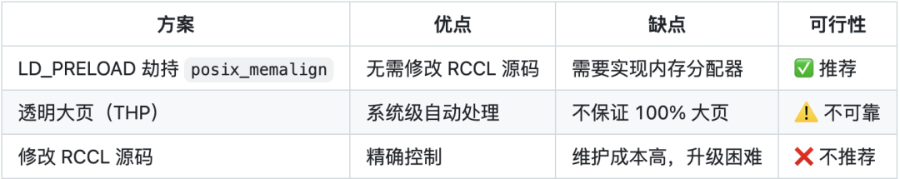

本文为达坦科技DatenLord新系列文章【开源周报】的第一篇。

设立这一系列的初衷，是为了更透明地分享达坦科技开源项目的成长轨迹。在这里，我们不仅会同步项目近期的核心开发进展与技术突破，更将通过路线图为您揭示未来的演进方向。

📍 项目地址与参与

GitHub 仓库： https://github.com/open-rdma/open-rdma-driver
（点击文末“阅读原文”跳转）

我们诚挚邀请所有对高性能网络、Rust系统编程或RDMA技术感兴趣的朋友点击链接关注、支持我们的项目。开源的力量源于社区。您的每一次关注、讨论或代码贡献，都是项目前进的重要动力。期待与您携手，共建更完善的高性能基础设施生态。

## 本周进展

1. 修复 Mock 模式下 WriteImm Verbs 语义 (commit: 7b74626)

问题描述：

Mock 模式下的 ibv_post_send() 使用 IBV_WR_RDMA_WRITE_WITH_IMM 操作码时，未正确消耗接收端的 RQE（Receive Queue Entry）

不符合 RDMA 规范：WriteImm 操作应在接收端生成 Completion 并消耗一个 RQE

修复内容：

修改了 src/verbs/mock.rs 中的 WriteImm 处理逻辑，确保正确消耗 RQE

更新了 src/rdma_utils/types.rs 中的 RDMA 操作类型处理

调整了 src/workers/completion.rs 的完成队列处理流程，为sim模式修复做铺垫

代码变更：4 个文件，新增 165 行，删除 50 行

待办事项：

Sim 模式和 Hardware 模式下的 WriteImm仍需进一步修复和验证

2. 地址类型系统重构 (commit: 0a5d0f6)

重构动机：

原有代码中地址使用 u64 表示，缺乏类型安全保障

容易混淆虚拟地址、物理地址、远程地址和寄存器偏移

可能导致严重错误：DMA 使用错误地址、RDMA 操作使用本地地址等

实现方案： 新增 src/types/addr.rs (372 行)，引入四种类型安全的地址抽象：

VirtAddr: 本地用户空间虚拟地址

用于 ibverbs API 传入的内存地址

提供指针转换、偏移计算、对齐检查等方法

必须转换为物理地址后才能用于 DMA 操作

PhysAddr: 物理地址（DMA 操作）

用于硬件 DMA 访问的真实物理地址

通过 AddressResolver trait 从虚拟地址转换得到

提供 split() 方法将 64 位地址拆分为高低 32 位（用于硬件寄存器写入）

RemoteAddr: 远程虚拟地址（RDMA 目标）

表示远程机器上的虚拟地址

用于 RDMA Write/Read/Atomic 操作的目标地址

不提供 as_ptr() 方法，因为无法在本地解引用

影响范围：

修改了 26 个文件，新增 773 行，删除 319 行

涉及内存管理、描述符、网络、RDMA worker 等核心模块

编译期类型检查，零运行时开销（#[repr(transparent)]）

3. 调研 RCCL 内存注册行为

背景：

当前驱动仅支持 CPU 内存 MR 注册

要求注册的 MR 页大小必须为 2MB 大页

RCCL 内存注册方式分析：

RCCL 支持三种 MR 注册方式：

1. GPU 内存 + dma-buf 模块（GDR）

使用 ibv_reg_dmabuf_mr verbs

通过内核 dma-buf 模块进行 GPU 内存注册

MLX5 有专门优化，属于现代化方案

需要内核模块支持

2. GPU 内存 + Peer Memory（GDR）

使用传统 ibv_reg_mr verbs

通过 Peer Memory 方式访问 GPU 内存

当前测试的 GPU 卡不支持此路径，同时支持此路径的 GPU 卡也不是很多

3. CPU 内存（当前使用）

使用 CPU 内存作为 GPU 数据中转

当前驱动的运行模式

页大小问题：

RCCL 未提供环境变量控制页大小，解决方案对比：

GPU 内存注册规划：

dma-buf 是更现代的方式，优先考虑这种方式

GPU 最小页大小为 64KB

需要在内核 KO 模块中增加 dma-buf 操作支持

## 下一步规划

短期任务

1. 修复 Sim/Hardware 模式下的 WriteImm 语义

将 Mock 模式的修复逻辑移植到其他模式

确保所有模式下 WriteImm 行为一致

2. 实现 2MB 大页内存分配劫持

使用 LD_PRELOAD 技术劫持 posix_memalign

确保 RCCL 申请的缓冲区使用 2MB 大页

验证对 RCCL 性能的影响

中期规划

3. GPU 内存注册支持

调研 dma-buf 内核接口实现

设计 GPU 内存到物理地址的映射机制

评估内核模块修改范围

## DatenLord 正在积极构建高性能AI+Cloud基础设施平台，现开放AI Infra实习生 岗位招募！
岗位一：高性能网络驱动程序开发实习生（Rust语言方向）

工作内容：

负责使用Rust语言开发RDMA网卡的用户态驱动程序，与硬件进行交互、控制。

负责使用Rust语言开发RDMA网卡的用户态驱动程序，对上层verbs API提供兼容接口。

负责对Rust语言开发的RDMA网卡驱动程序进行性能测试、性能优化。

岗位要求：

熟练掌握Rust编程语言。

有Linux驱动程序或嵌入式程序开发经验（C语言或Rust语言），熟悉软件与硬件的常见交互方式。

深入了解Linux操作系统，对操作系统内存管理、内存映射等技术有深入理解。

了解RDMA技术及Verbs API。

有开源社区代码贡献经验者优先。

岗位二：高性能RDMA网卡FPGA硬件开发实习生

工作内容：

负责使用Bluespec SystemVerilog语言进行RDMA网卡的RTL编写。

负责使用Bluespec SystemVerilog + cocotb对逻辑功能进行仿真、验证。

负责在FPGA上进行后端P&R流程、时序调整，确保逻辑上板可用。

岗位要求：

自学掌握Bluespec SystemVerilog语言。

熟悉Xilinx、Altera系列FPGA的开发流程。

熟悉PCIe及以太网控制器相关的开发工作。

熟悉Linux系统下，以太网及PCIe相关调试流程。

能够独立完成FPGA的RTL编写、仿真、时序调整、上板测试工作。

了解RDMA技术。

📮 如何申请？欢迎点击文章 【AI与高性能网络领域】一大波线上线下实习向你袭来！，跳转至我们的官方招聘页面，查看完整的职位详情与申请流程。

**达坦科技**始终致力于打造高性能 **Al+ Cloud 基础设施平台**，积极推动 AI 应用的落地。达坦科技通过**软硬件深度融合**的方式，提供高性能存储和高性能网络。为 AI 应用提供**弹性、便利、经济**的基础设施服务，以此满足不同行业客户对 AI+Cloud 的需求。

**公众号：** 达坦科技DatenLord

**DatenLord官网：** https://datenlord.github.io/zh-cn/

**知乎账号：** https://www.zhihu.com/org/da-tan-ke-ji

**B站：** https://space.bilibili.com/2017027518

**邮箱：** info@datenlord.com

如果您有兴趣加入**达坦科技Rust前沿技术交流群或硬件相关的群**  ，请添加**小助手微信**：DatenLord_Tech
