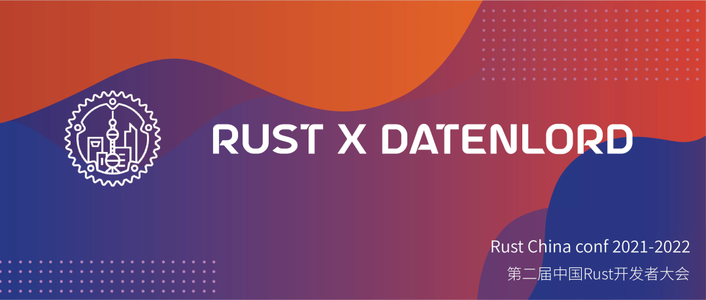

达坦科技自成立以来积极探索**软硬件深度融合**，专注于打造新一代的**开源跨云存储平台**，以满足不同行业客户对数据跨云、跨数据中心高性能访问的需求。

今年以来陆续发声，将达坦科技开源项目 async-rdma 的技术实践和案例对外输出，坚定地做 Rust 语言的布道，也将达坦科技探索的新一代硬件敏捷开发的研究成果在各硬件技术大会上做分享（本周的次条为达坦科技的团队在南京参加**中国计算机学会芯片大会**的回顾）。

## 专题演讲

作为一家 **All in Rust** 的科技初创公司，上周日召开的第二届中国 Rust 开发者大会肯定不会缺席，达坦科技更是在下午专题演讲和研讨会两个场次分享了公司运用这一在基础底层软件开发中日益受欢迎，即将有望成为 Linux 官方第二语言的实践开发经验。

首先，达坦科技联合创始人施继成在大会下午场-Rust 在嵌入式、操作系统和物联网的应用实践的专题组做了题为 **Rust for Linux is Coming** 的专题分享。Rust for Linux 背后的逻辑是指不改变 Linux 操作系统的接口，用渐进的方式最终完全兼容现有 Linux 上的所有应用程序的方案。虽然这一工具目前还没有进入主分支，但已经进入了 Linux-next 分支。施继成将 Rust for Linux 比作程序员进行软件开发的脚手架，并详细拆解了它的六个主要组件的核心内容和技术要点。

## 线上 workshop

正因为 Rust 语言的实用价值，吸引了越来越多的程序员想要尝试学习 Rust。因此，在 Rust 大会上，达坦科技还举办了一场干货满满的线上 workshop：用 Rust 实现 RDMA 高性能编程。达坦科技技术团队首先普及了 RDMA 的设计理念、其本身的优缺点，以及目前主流的 RDMA 和以太网融合的两种方案及其优劣。

随着未来 RDMA 应用场景的大大拓展（例如：在广域网、跨数据中心场景中使用），提高 RDMA 编程性能，改善 RDMA 内存管理是关键。所以，在第二场研讨会技术演示阶段，达坦科技技术团队着重介绍了 RDMA 权限管理和远端内存操作，并就其目前已经开源的项目为例，详解了 async-rdma 的设计理念和逻辑，包括 RDMA 异步 I/O，RDMA 高层通信协议等。

在 workshop 的最后还准备了动手的实验环节，让参与讨论学习的与会者实际体验如何用 Rust 构建 RDMA 应用。

正是因为用 Rust Bindgen 生成底层 RDMA 接口，并不安全。因此，达坦科技在此上面提供了 RDMA 高层异步接口进行封装。因为达坦科技专注于做软硬件结合的存储系统，不可避免地要和 Linux 内核打交道，所以，Rust for Linux 帮助我们构建安全且有效率的存储系统。

## 参与我们

目前，我们将整个库放在了 **Github.com/datenlord/async-rdma** 上，并且也在持续迭代中，欢迎感兴趣用 Rust 语言实现高性能编程的你前来讨论。

有意加入 **Rust 前沿交流讨论群**，请添加小助手微信：

