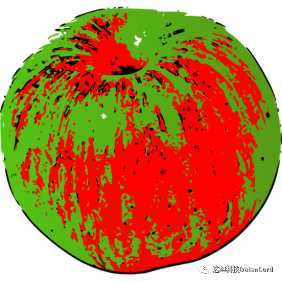

2022 年 12 月 16 日，达坦科技联合 SpinalHDL 社区，举办了 SpinalHDL Webinar 2022。在题为《SpinalHDL 应用前景探索》的线上研讨会上，九位分享人在三个讨论分主题下做了各自领域内应用 Spinal HDL 的实践、挑战和经验的分享。

## 数据通路加速

**分享人：Tianrui Li**

**演讲主题:** Utilizing SpinalHDL for large-scale datapath design

**演讲摘要:** This presentation introduces the experience and case of large-scale data path design using SpinalHDL with functional programming and third-party libraries. Take a completely parallel elliptic curve adder as an example.

---

**分享人：Jeff-Ciesielski**

**演讲主题:** Utilizing SpinalHDL to Accelerate Neuroscience

**演讲摘要:** This presentation covers how LeafLabs leverages SpinalHDL to enable the rapid development of a devices used for Neuroscience research ranging from mixed-signal Electrophysiology ASICs to FPGA based designs for system control and USB3 connectivity.

---

**分享人：Teilraum**

**演讲主题:** A Network Attached Deep Learning Accelerator for FPGA Clusters

**演讲摘要:** This presentation introduces a Layer parallel framework for DNN training on an FPGA cluster. All hardware description is done using SpinalHDL. It gives an overview of approaches and examples where SpinalHDL came in handy.

---

## 复杂系统设计案例

**分享人：Saahm**

**演讲主题:** SpinalHDL in Computer Architecture Research. A) MicroRV32 Platform and B) FPGA-based Heterogeneous Real-Time Systems with RISC-V

**演讲摘要:** The presentation covers two topics in which SpinalHDL aided in the Research of Computer Architecture. MicroRV32 is a RISC-V SoC Platform built with SpinalHDL for research and education aligned along a RISC-V Virtual Prototype in SystemC TLM. The second topic covers a topic on Task Mapping and Scheduling in FPGA-based Heterogeneous Real-time Systems. There the VexRiscv-based Murax SoC was used on an FPGA as a Heterogeneous Real-time System for a Case-Study.

---

**分享人：Distributed**

**演讲主题:** Title: Coding a microprogrammed protocol receiver in SpinalHDL

**演讲摘要:** This presentation introduces a microcode-like approach to coding a communications protocol receiver used in flying, handheld and stationary 3D scanners. Decoding the protocol in random logic leads to unattractively high resource usage. Therefore, a microprogrammed approach was chosen where data out of preprogrammed memories controls the rather regularly organized data path. The talk highlights the construction of the microinstructions and their physical representation, showing how code evaluated at Scala runtime can be elegantly intertwined with Spinal code representing hardware.

---

**分享人：Dolu1990**

**演讲主题:** NaxRiscv : A Pipeline / Plugins / SpinalHDL / Scala mix

**演讲摘要:** This presentation / live demo shows how the NaxRiscv project (Out-of-order / superscalar RISC-V CPU) mix Scala and the SpinalHDL API to describe its hardware. By many aspect, it goes beyond the VexRiscv project, and should provide some usefull / interresting design patterns for the public.

---

## 硬件设计流程

**分享人：Readon**

**演讲主题:** Recent progress on formal verification support on SpinalHDL

**演讲摘要:** The formal verification is a technology to verify design, which helps to find the corner cases. SpinalHDL have provided an integration of this tech with SymbiYosys easily. The brief introduction on how to verify a design would be presented by example. Some new build blocks helping to simplify the verification process would be introduced. At last, a short overview of the verification of some facilities in SpinalHDL's lib would also be summarized.

---

**分享人：Sebastien-riou**

**演讲主题:** SpinalHDL for ASIC

**演讲摘要:** The presentation is a highlights of a ASIC done entirely in SpinalHDL, fabricated in GF22FDX. Focus on pads, RAMs and FPGA for ASIC verification.

---

**分享人：Andreas-Wallner**

**演讲主题:** From Peripheral Plugins to Product documentation.

**演讲摘要:** The presentation shows how we can go from a simple plugin system for bus peripherals using register file generators to documentation using custom Sphinx plugins. Also shows some insight into ongoing development of a lab communication device for in-the-loop testing.

---

对开源硬件感兴趣的朋友，欢迎添加小助手微信，加入达坦科技硬件群。

目前达坦科技的硬件项目 TRIDENT，已经在 GitHub 上开源，欢迎参与讨论：  
https://github.com/datenlord/TRIDENT

## 推荐阅读

[万字长文，详述 TRIDENT: Poseidon 哈希算法的硬件加速与实现！](https://mp.weixin.qq.com/s?__biz=MzkwNTMzOTE2MA==&mid=2247484375&idx=1&sn=58a5507fc5ca9eee133afcc5ae84487f&chksm=c0f80ba0f78f82b6db1298cfd56e3cbb8749812c320e41d0f12706d2d3a695b633f919dffd21&scene=21#wechat_redirect)

[精彩回顾｜硬件敏捷开发与验证方法学研讨](https://mp.weixin.qq.com/s?__biz=MzkwNTMzOTE2MA==&mid=2247484608&idx=1&sn=73ce9ea07f82ae5e89d56c8666d88576&chksm=c0f80cb7f78f85a1ae5a1624bb6660f0b1a2703ac2cf5921d3dcebf5c22045ce990a22976456&scene=21#wechat_redirect)
