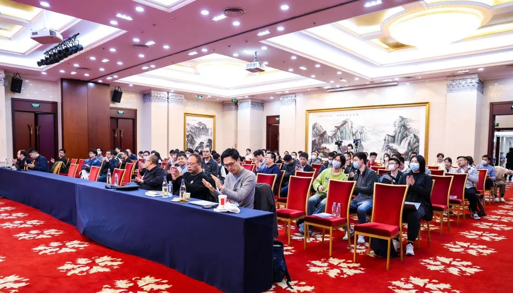

**2023 年 4 月 8 日，达坦科技联合南京大学、CloudWeGo、华为等技术专家成功举办了题为 Rust 💡X 的 meetup**。开发者们不仅线下积极报名参与，更在线上直播中踊跃参与互动，一起探讨 Rust 作为一种强调性能、安全和并发性的编程语言的各种应用和实践。演讲者与观众间灵感与想法的不断碰撞正印证着本次的主题：**用 Rust 编程语言“点亮”的任何应用、实践，和探索 Rust 的无限可能性**。接下来让我们一起来回顾本次活动的精彩瞬间。

## 精彩回顾

本次 meetup 首先由 **《Rust 编程之道》作者、Rust 中文社区布道者张汉东老师**开场，Rust 语言以安全性著称，但他演讲的主题却为 **《理解 Unsafe Rust》** 。张老师从为什么需要 unsafe、unsafe 能做什么，到 unsafe 安全哲学、Unsafe 编程准则，循序渐进，由浅入深地一步步讲解。最后更是引用 reddit 热帖，将 Unsafe Rust 与 Zig 进行安全性对比：Unsafe Rust 的安全哲学让开发者可以充分地思考裸指针的安全问题，对开发者有更高的要求，系统的安全性可能更好，Reddit 热帖的作者虽然推崇 Zig 策略，但 Zig 的安全策略并非百分百安全，同样需要开发者考虑一些安全因素，因此，并没有什么谁比谁更安全一说。

接下来**南京大学计算机科学与技术系助理研究员冯洋老师**进行 **《基于实际场景应用分析的 Rust 库模糊测试技术报告》**的演讲分享。Rust 是一种承诺内存安全和并发安全的语言，而各类 Rust 库中 API 的漏洞与缺陷可能会对所有使用该库的程序产生影响。为了进一步保障 Rust 库的安全，冯老师提出了一种依靠现有 Rust 生态系统来生成模糊测试目标的方法，利用 MIR 解析待测库所在生态系统中的项目，找到现实中 API 之间的调用和依赖关系，从而从中提取出待测库的 API 序列，依此生成 Rust 库的模糊测试目标。

第三位出场分享的是**达坦科技联合创始人兼 CTO 施继成**，演讲主题是 **《Rust for linux6.2》**。他从为什么选择 Rust、Rust for Linux 以及 Linux6.2 三个方面依次递进介绍。我们选择 Rust 不仅因为其拥有与 C 语言类似的高效率特性，其同时也具备 Java 语言所拥有的强安全性，高效率与高安全性的组合带来了许多 Rust 在 Linux 中的尝试。Rust for Linux 并不是要取代 Linux 中所有的 C 代码或是在 Rust 中提供所有的 Linux 内核模块，它是一个框架或工具，帮助用 Rust 构建 Linux 模块。接着，施老师介绍了 Rust for Linux 的核心组成部分与如何编译 Linux 的 Rust 支持，并以 ChrDev 为例做了进一步的讲解。最后，施老师对 Linux6.2 做了简单的评论，他认为 Linux6.2 增加了一些基本支持，除了将工具链从夜间版改到稳定版（1.62.0 ）以外，这个版本也改进了对字符串和格式化、错误、打印、内存分配、宏的支持。但若想直接从 Rust for Linux 项目移植还得等待以后的版本。

**华为技术有限公司叶天星老师**接着就 **《用 Rust 实现 Git 传输协议、Git 对象解析和数据库存储》**进行了分享，他从 DVCS，Git Objects，Git Packfile 和 Git 传输协议四个方面进行了介绍。Git 作为“版本控制软件”之一，是目前最受欢迎的控制版本，其目的不仅是存储一组文件的当前状态，而且还包括这些文件随时间如何变化的历史记录。它使用了一种称为对象存储的方式来存储代码版本信息，且拥有 blob、tree、commit 和 tag 四种对象类型，叶老师也分别依次对它们进行了介绍和讲解。Git 可以使用四种不同的协议来传输数据：Local、HTTP、SSH 和 Git，本次分享中主要就 HTTP 和 SSH 进行了讨论，在演讲的最后，叶老师进行了 demo 演示，以方便观众进一步理解与掌握。

最后，来自 **CloudWeGo 社区的 Monoio 项目负责人茌海老师**做了 **《Monoio：一个基于 io-uring 的 Rust Runtime》**的分享，他介绍了 Rust 语言中的异步机制、Monoio 设计与 Runtime 的对比及应用。茌老师举例说明，揭露了 Async Await 背后的秘密，并对 Rust 中对异步 Task 的核心抽象--Future 抽象，进行了更深一步的讲解。Monoio 设计通过 Feature 与代码指定 Driver 并有条件地做运行时探测，拥有暴露统一的 IO 接口同时内部利用 OpAble 统一组件实现，是上层无感知的 Driver 探测与切换；其高性能、功能性与兼容接口等特点也带来了诸多便利。

## 结束语

在本次分享中，我们看见了 Rust 语言的多种可能性，更是切身体会到了其无尽的潜能与蕴含的力量。**要写出真正安全高效的 Rust 代码离不开所有真正热爱它的同学的投入与开发。Rust 已然在悄悄改变我们的世界，期望未来可以看到 Rust 更多样化的应用与实践。**

## 往期文章推荐

[《Rust You Don't Know》](https://mp.weixin.qq.com/s?__biz=MzkwNTMzOTE2MA==&mid=2247484900&idx=1&sn=1bee5d09f4286d4067e26b62c0fe134b&chksm=c0f80d93f78f8485c187a398a4c8834fd0798bdaf9e0305b93be0ed03dc4af982eaee6c70338&scene=21#wechat_redirect)

[《Rust for Linux 要来了，这对我们意味着什么》](https://mp.weixin.qq.com/s?__biz=MzkwNTMzOTE2MA==&mid=2247484429&idx=1&sn=9eaf3b79376d78182d16b0b3e5faadf7&chksm=c0f80c7af78f856c25c86fba4b6657d99d5464f5e8f3f35e782e44dc72e1ae7526adea66a8dc&scene=21#wechat_redirect)

[《创业公司为什么要选 Rust 做 RDMA 库？》](https://mp.weixin.qq.com/s?__biz=MzkwNTMzOTE2MA==&mid=2247484037&idx=1&sn=8363fb4610e89bfb1dfb714752e8f5b0&chksm=c0f80af2f78f83e4437ebb56f90be3ddfea2321213fa9b352151386d087ce93d7a962fffe442&scene=21#wechat_redirect)
