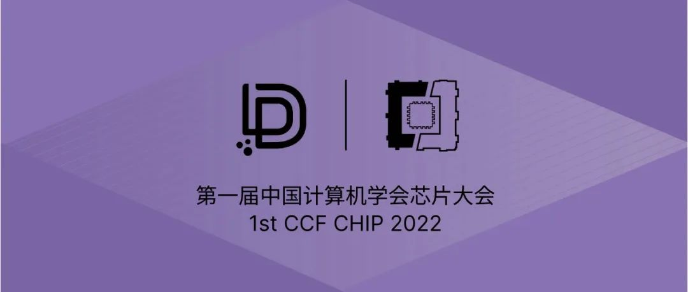
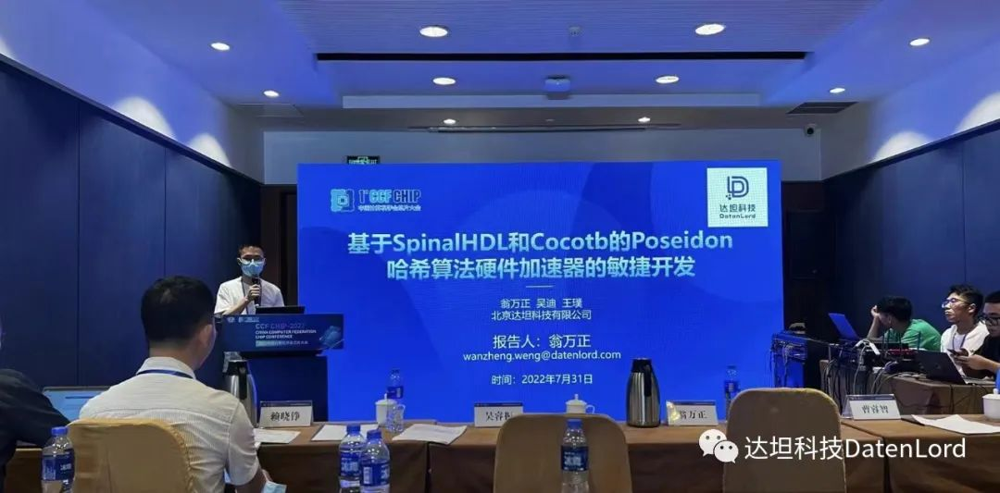
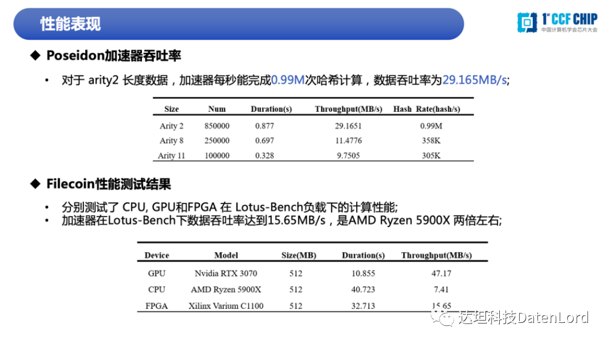

2022 年 7 月 29 日至 7 月 30 日，由中国计算机学会（CCF）集成电路设计专业委员会、容错计算专业委员会、体系结构专业委员会和信息存储技术专业委员会联合举办的学术大会中国计算机学会芯片大会在江苏南京如期圆满举行。

2022 年 CCF 芯片大会由中科院计算所孙凝晖院士、中科院微电子所刘明院士担任大会主席，集结国内外知名专家学者，围绕智能化时代的芯片技术主题，论述芯片领域国际最前沿、权威和新颖的学术观点，包括芯片设计与 EDA、新型体系架构、前沿存储技术、容错计算应用等方面的关键技术和应用前景。

达坦科技致力于软硬件深度融合的跨云存储平台，其硬件负责人吴迪带领研发团队在今年的**Xilinx 全球自适应计算挑战赛**上刚获得**Big Data Analytics 赛道一等奖**。此次，达坦科技提交的论文“**基于 SpinalHDL 和 Cocotb 的 Poseidon 哈希算法硬件加速器的敏捷开发**”也成功入选，并受邀在大会做分享。达坦科技的翁万正在 30 日下午领域专用架构与敏捷设计论文分组，向与会者介绍了研究背景、方法技术和实验结果。

Poseidon 是一种全新的面向零知识证明的(ZKP:Zero-Knowledge Proof)密码学协议设计的哈希算法。相比经典的 SHA-256 和 Keccak 哈希函数, 在零知识证明的应用场景下, Poseidon 能够显著地减少哈希函数的约束条件进而降低证明的计算复杂度, 极大提升零知识证明系统的运行效率。Poseidon 哈希函数的计算涉及高位宽模乘和矩阵乘法运算, 需要消耗大量计算资源。为了提升哈希计算的效率, 达坦基于流水线和折叠技术提出了一种面向 FPGA 平台的 Poseidon 硬件加速器架构。

在该整体架构下, 针对高位宽模乘, 达坦科技基于 Karatsuba 乘法拆分算法实现了一种高性能蒙哥马利模乘器。针对函数中的向量—矩阵乘法计算, 达坦科技基于脉动矩阵结构提出了一种高吞吐率的硬件实现。最终, 在搭载有 Xilinx Virtex Ultrascale+ FPGA 芯片的 Varium C1100 加速卡上, 硬件加速器每秒最高能完成 0.99M 次哈希计算, 达到 AMD Ryzen 5900X 处理器 Poseidon 计算速度的两倍。

除了打造全新的广域网共识算法，达坦科技专注于自研面向存储网络的硬件加速，以期软硬件的深度融合能提升存储的性能。目前达坦科技的硬件项目 TRIDENT，已经在 Github 上开源，欢迎参与讨论：https://github.com/datenlord/TRIDENT。
