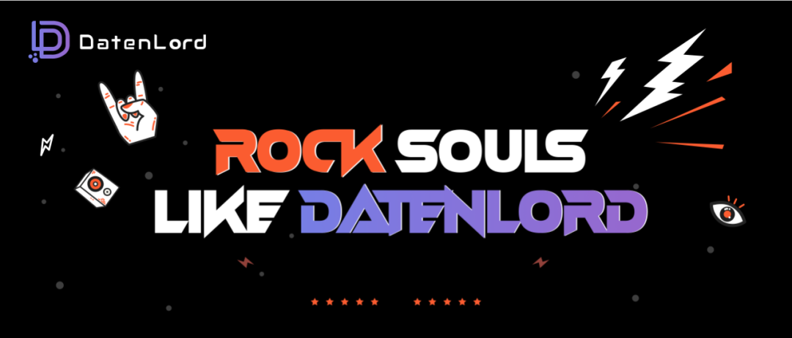

> “我读大学的时候玩乐队，弹奏最多的就是 Guns N' Roses（枪花）乐队的歌曲。枪花 1987 年发行的第一张专辑叫《Appetite for Destruction》。虽然我不至于有毁灭欲，但都说创新的本质其实是‘创造性地破坏’，创业亦然。离开大公司后我连续投身科技创业，想要静心做底层技术的颠覆性创新。想来也算是年轻时追求的摇滚精神跨时空的延续。”  
> ——王璞 达坦科技创始人兼 CEO

**王璞：** 美国 George Mason 大学计算机博士、北大硕士、北航本科，拥有多年云计算和大数据领域的经验和积累，擅长分布式系统研发、海量数据处理、云计算产品设计及大规模机器学习等。2014 年回国创业，创立数人云科技公司，专注容器技术在国内的落地和推广，2018 年被上市公司收购。曾发表十余篇论文，共计被引用上千次，拥有多项云计算专利、软著，并于 2020 年被评选为腾讯云 TVP（最有价值专家）。下文用“Pu” 代替。

---

> “魂系游戏和创业很相似，前者大量的离散叙事遍布于各个物件和 NPC 上，寻找主线剧情就好比创业时把客户的需求、公司的技术优势、VUCA 时代瞬息万变的市场变化和趋势等都链接起来，形成完整的产品叙事并落地。两者的难度系数都很高，创业中的踩坑、犯错对应的是游戏中的‘死亡’，所以，‘不死精神’或者说‘Grit’（坚毅）是魂系游戏和投身创业企业玩家的必备素质。”  
> ——施继成 达坦科技联合创始人兼 CTO

**施继成：** 复旦大学软件工程本硕，师从华为基础软件首席科学家、鸿蒙实验室主任陈海波教授。擅长操作系统内核开发、分布式系统、嵌入式系统，对分布式数据一致性有钻深的研究，发表多篇操作系统内核相关论文，累计数百次引用。毕业后曾在谷歌中国、微软亚太和阿里巴巴等公司从事分布式计算和存储等相关工作。入选 2022 年度 36 氪 S 级创业者名册，荣获中国“企业工具与底层软件”领域 “36 位 36 岁以下创业者”称号。下文用“JC”代替。

## 缘起

一件好的艺术创作，常常能够让人们透过作品感受到作者的精神世界与价值观；一家创业公司也往往是创始团队的内在映射。ChatGPT 问世以来，有人把它类比为哥伦布发现了新大陆。现如今的创业就好比大航海时代的探险，最大的不确定性就是不知道继续航行下去，前方到底是宝藏还是死亡。创业从来都是一件举步维艰的事情，创业成功也永远是小概率事件，但依然难以熄灭企业家的创业精神。不仅仅是因为其背后的财富价值，在诸多兼备社会责任的企业眼中，更多的是**推动科学技术的发展和产业进步，将技术和落地应用相结合，进而创造更多的社会价值。**

达坦科技作为科技创业企业的一员，至今刚刚走过两个年头。我们邀请两位联合创始人，一起给大家讲述达坦科技的故事。

## 我们的故事

**Q：当时是在什么契机下决定要创立达坦科技呢？**

**Pu：**  
首先我和继成过往的经验一直都是在云计算、分布式系统相关领域。我自己一直是一个喜欢创业的人，上一家公司被收购之后尝试着在上市公司做高管，但说实话不喜欢。上市公司部门多组织复杂，里面繁冗的流程、复杂的人际关系，这些都不是我想要的，所以决定还是要出来创业，专注前沿技术，并且从创业最初期就特别关注团队的人才培养和文化建设，营造追求极致的技术氛围。

既然创业肯定还是希望能赢，那就需要对未来的发展趋势有准确的判断。我们的判断是整个互联网还会有新的增长曲线或者说新的浪潮。只要这个判断成立，那么对云计算和云存储的需求理论上就是持续上升的，甚至会有更大的增量空间。随着 AI、Web3.0 特别是 ChatGPT 的兴起，我们的判断也得到一些印证：比如 ChatGPT 要 1 万张 GPU 卡做训练，这需要相当大的计算和存储资源来支撑。那么 DatenLord 要做的就是突破现有云计算的规模，实现从云计算到天空计算。**能做自己擅长并喜欢的事情，找到一群志同道合的人，挑战技术极限，做前沿技术的弄潮儿，没有什么比这个更让人兴奋的。**

**JC：**  
我从另一个角度补充一下。作为技术人员，能够深入钻研技术是很令人开心的一件事情。技术人员往往更愿意在感兴趣的领域进行深挖，探索其中的深入问题，甚至是一些世界级的前沿技术和问题。当然这也需要花费大量的时间和精力，短时间的速成往往是欲速则不达。我们在创办 DatenLord 的时候就**想做这么一家沉下心钻研技术的公司，相信也会吸引一群有同样追求的人员加入我们。**

另外一方面，**深入的技术钻研和投入更能够形成技术壁垒，避免了企业间的同质化竞争，最终更能够从某一个领域脱颖而出，这些对于一家 ToB 的科技型企业至关重要。**

---

**Q：为什么选择“跨云”这个细分领域？**

**Pu：**
**跨云存储是非常有挑战的问题，达坦科技立志要做出世界级产品，我们选择的领域也是业界公认的难点。**

回答这个问题之前，我们先看看云计算的现状：现在的云计算其实是一座座围城，用户一旦进入一座围城中就很难再翻越出来。例如用户一旦开始大规模使用私有云部署，一段时间之后想要上公有云就非常困难；又或者用户一旦选择了一家云计算厂商，之后想要迁移到另外一家厂商成本就会很高。

因此，我们认为未来的云计算会跨越现有云计算的边界——未来的云计算应该是“相互联通”的，这也就是 UC Berkeley 的 Ion Stoica 教授提出的天空计算。云计算的用户应该非常容易能够在多个云计算厂商之间进行切换，选择适合自己的服务，选择性价比更高的服务。同时用户也能够在私有云和公有云间无缝衔接，在计算性能拓展和安全性之间找到一个平衡。

**JC：**  
是的，如何高效解决数据远程访问的问题是上云碰到的最突出问题，有了高性能跨云数据访问能力，即可以轻松上云又可以突破云厂商的绑定，让客户真正享受到云计算带来的弹性便利。而想要能大幅度提升跨云数据访问性能，就需要做**软硬件深度融合**。目前软硬件融合领域，不论对互联网公司、云计算巨头，还是老牌企业级 IT 厂商，都是极具挑战的场景。总之，达坦选择跨云存储领域，具有很高的技术门槛，即使对大厂来说也很有挑战。我们跟巨头站在差不多的起跑线上，**真正用技术实力来竞争。**

---

**Q：达坦科技希望能带来什么样的价值呢？**

**Pu：**  
**我从市场和产业的角度**说一下吧。一方面，随着云计算的普及，企业客户对应用上云已经形成共识，但是企业客户对于数据上云还有不少顾虑，会更倾向于将数据保存在可控的环境，比如私有数据中心。那企业应用上云后**如何访问远程私有数据中心的数据，成为云计算进一步普及落地亟需解决的问题。**

另一方面，随着云计算进一步发展，**业界基本公认无服务计算成为下一代云上应用的计算形态**，无服务计算使得应用的部署调度更加灵活，但是数据无法随应用任意迁移，于是无服务计算大大增加了应用对于数据灵活访问的需求，即不论应用部署在哪里都要能高效访问到需要的数据，**所以远程跨数据中心、跨地域甚至跨云数据访问成为下一代云计算最大的挑战。**

**达坦想做的，就是解决这两个具有挑战性的问题，为用户提供高性能、安全的跨云数据访问体验。**

**JC：**
跨云存储是非常有挑战的场景，不仅要保证跨云数据访问的性能，更要保证跨云访问场景下，数据被竞争读写时仍然能保证数据一致性（正确性），即跨云、跨数据中心的数据一致性。**我们当前已经推出的 DatenLord 开源项目可以实现跨云、跨数据中心场景下远程数据高性能访问，一方面方便企业客户的应用上云后访问远程私有数据中心的数据，另一方面方便无服务计算的应用（跨云）访问远程数据。**

随着 ChatGPT 引爆整个科技领域，AGI 的产品在颠覆搜索引擎的同时，也对存储提出了更高的要求。对我们来说，**既需要保证原有战略方向的稳定及快速迭代落地，又需要快速的学习和重新锚定市场需求发展趋势，调整航向。** 因此，我们不仅在产品开发过程中使用了 AGI 的相关技术进行辅助，而且还在探索为大模型机器学习提供高效存储的可能性。

## 选择拥抱开源

**Q：为什么会选择用开源的形式呢？**

**JC：**  
一方面我们创始团队全部是技术背景，**作为技术人员，开源是深植于意识深处的，**我们认为现在的基础设施就应该是开源的，就好像无数成功的先例一样，如 Linux，K8S 等。我们团队也认为**开源能够大大促进技术进步，只有不断地交流才能产出更好的技术产品。**

另外一方面，**我们也想借助于开源的社区平台吸引更多优秀的开发者参与到项目中来**，Linux 已经证明了全球的开发者是多么得具有创造性，能够开发出什么级别的产品。因此我们也相信开源带来的优秀贡献者们也能使得这些项目更加完善，更加优秀。

**Pu：**  
是的，我们的产品也是开源的。开源是一种高效的推广方式，可以帮助用户以最低的成本来使用我们的产品。

---

**Q：DatenLord 目前已有的开源项目有哪些？可以简单介绍下吗？**

**JC：**  
达坦是一家拥抱开源的公司，在 GitHub 上有不少我们的开源项目，DatenLord 是我们的主力开源项目，我们把 DatenLord 用到的很多组件也单独开源出来：

- DatenLord 跨云存储系统：  
  https://github.com/datenlord/datenlord

- **Xline 开源分布式 KV 存储系统：** 保证数据在跨数据中心、跨云访问时的一致性，方便业务系统实现多地多中心多活部署。  
  https://github.com/datenlord/Xline

- **RDMA：** 跨云场景下，网络对数据访问的性能影响最为突出，DatenLord 采用高性能网络 RDMA 来降低延迟并提高带宽。RDMA 方面我们有多个相关的开源项目：

  - async-rdma 是用 Rust 封装的 RDMA 异步 API 库，它为编写 RDMA 应用程序提供高级抽象和异步 API 接口。  
    https://github.com/datenlord/async-rdma

  - open-rdma 是 RDMA 协议的开源硬件实现，采用 Bluespec 和 SpinalHDL 实现，目前主要实现了 RoCEv2 协议。此外，我们还进行一些特定功能的拓展来提升 RDMA 的传输效率。  
    https://github.com/datenlord/open-rdma

  - roce-sim 是一套验证 RDMA 协议的软件框架，方便测试 RDMA 硬件的正确性，即是否符合 RoCEv2 协议的要求。  
    https://github.com/datenlord/roce-sim

- async-dpdk：用 Rust 封装的 DPDK 异步 API 库，用于在虚拟化场景下基于 DPDK 实现高性能网络。  
  https://github.com/datenlord/async-dpdk

**欢迎感兴趣的同学来交流合作。**

## 企业文化

**Q：像软件在用的 Rust、硬件的 Bluespec、SpinalHDL 这样的语言都很前沿，达坦为什么会选择用这么前沿的技术语言？**

**JC：**  
Rust 更像是一把刀，以前的保护措施不好就容易切手。现在的情况是既能切的快，还可以不容易伤到手，让它很有希望成为 Linux 第二个语言，当前 Rust 在国外也是很有影响力的语言

这些年当涉及到底层系统软件开发的时候，Rust 几乎成为了不二之选。原因是它不仅提供了优秀的语言级别安全性保障，还提供了 C 语言相似的性能，因此我们也顺势选择了 Rust 语言，未来该语言的前景是不可限量的。

另外一方面，**Rust 语言本身的特性也很符合我们的企业文化，我们希望我们的产品在产出的第一天就将安全和稳定放在首位，Rust 语言帮助我们更容易实现这个目标。**

**Pu：**  
跨云存储是全新的领域，而且极具技术挑战，达坦解决跨云存储的思路是采用业界最新的技术，提升开发效率，加速软硬件融合相关新技术落地。

达坦在软硬件领域目前有两方面专长，**一方面是跨云数据一致性，基于 Rust 语言实现；另一方面是 RDMA，基于 Bluespec、SpinalHDL 等新一代 HDL 实现 RDMA 的硬件。**采用新一代 HDL 语言来实现 RDMA 硬件，一方面落地硬件敏捷开发，大幅度提升开发效率；另一方面也在探索硬件敏捷验证，加速验证收敛，打造基于新一代 HDL 的全新硬件开发与验证流程。采用前沿技术，对人的要求很高，我们也是希望采用前沿技术来吸引优秀人才加入。

---

**Q：上一个问题继成提到了达坦的企业文化，能详细介绍下吗？**

**Pu：**  
达坦的同学都是勇于探索前沿技术的同学，大家因为热爱而聚到一起。所以在这里我们不局限于工作职责本身，更鼓励大家能勤于思考学习，找到自己感兴趣的事情，创造更多价值。

**首先达坦 always 会做一个强学习型组织，在这个基础上我们根据达坦同学具备的共同特质，提炼出了达坦的文化价值观，也可以说是我们的人才观：**

- **持续学习** 持之以恒的自驱学习，求真求致
- **积极主动** 遇到问题主动踏出第一步，做先行者而不是追随者
- **精益求精** 对自己高标准严要求，对创新有极致追求

除了以上这些软性技能的要求，对专业技能的要求当然也是很高的，因此我们对人才的培养非常重视。**一般刚入职的同学会先接受一个月时间的专业技能培训；此外，我们也会给正式员工每年两周的带薪学习假期，让大家有充分的时间自我精进。**

区别于其他公司的大规模扩张，达坦在组织建设上非常谨慎。我们相信物以类聚、人以群分。所以与其说是企业文化价值观，不如说是通过这些点去**识别真正热爱并追求挑战的同学，因为这样的一群人组成的团队才能具备真正强的战斗力，才能让公司在复杂的环境和激烈的竞争中立于不败之地。**

---

**Q：过往达坦一直积极参与在各种活动和技术社区里，目前达坦合作、创建的技术社区有哪些呢？**

**JC：**
前面的介绍大家可以看到，达坦已经开源了不少软硬件项目，**我们是国内首家同时开源 RDMA 软硬件解决方案的公司，** 开源写入了公司的基因。我们相信开放、友好、接纳的社区无论是对推动开源项目本身的成熟，还是帮助工程师个人的成长，都是一个“助推器”，是孕育孵化创意的生态。**当前其实已经在建立的高校合作、开源合作都很多。**

**Pu：**
如继成所说，**我们其实最开始是希望能从这些活动中去认识一群对前沿技术最了解和感兴趣的人。** 但随着和不同的人聊，包括有很多高校的教授沟通，我们会发现其实**大家会很需要从学校到工业界落地的一个过渡的培养。本着开源精神，我们觉得有义务去发起一些开源的活动和技术社区，帮助对技术真正有热情的同学。**

## 尾声

创业一如玩摇滚，自由和不妥协是其精髓。为了心中的理想与追求付出极致的热爱，才不枉人间走一遭。我们希望能通过这篇文章，让更多的人看见达坦背后的故事，也能找到属于自己的路。
