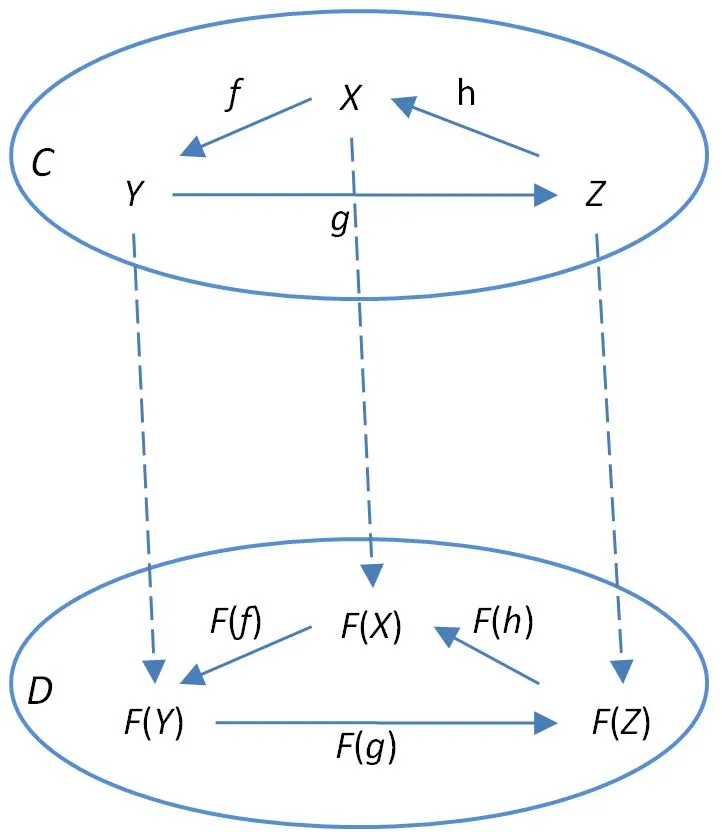
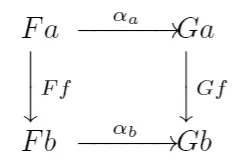

# Understanding Functor in Rust  

## Understanding Functor in Rust  

In this blog, we introduce the general concept of Functor and Natural Transformations. The blog provides examples of Rust, but we will explain more about its concepts and definitions in the following sections.  

In mathematics, a functor is a mapping between categories. It’s an obscure definition and looks horrible if you don’t like math. But don’t worry. Let’s look at an example.  

Suppose you have a mapping that plus one. Then if you pass an integer, it will plus it with 1. What if you pass a list of integers? It does not work if we add one to the list directly. However, we could use the map function.  

```rust
let f = |x| -> i32 { x + 1 };
let y = [1, 2, 3].map(f);
assert_eq!([2, 3, 4], y);
```  

In fact, Functor is just a way to preserve the structure.  

- - -

## What is a category?  

Back to the previous question, what is a category?  

A category C has objects, morphisms, and binary operation ∘ , which is called the composition of morphisms. In this context, we could view types as objects and their functions as morphisms. These functions could be composited with∘ . The (f ∘ g)(x) means apply f to g(x) . ie. (f ∘ g)(x) = f(g(x))  

Composition is governed by two axioms:  

1. Associativity: if f : a → b , g : b → c and h : c → d then h ∘ (g ∘ f) = (h ∘ g) ∘ f
2. Identity: For every object x, there exists an identity morphism 1x : x → x such that for every morrphism f : a → b , 1b ∘ f = f = f ∘ 1a  

## Option Functor

```rust
enum Option<T> { Some(T), None }
```

In Rust, we have Option type, which is either some value of type T or it is no value. As a Functor, it is not only a mapping from T to Option<T>, but also a mapping of functions. Option implements it as a map method.  

```rust
fn map<U, F>(self, f: F) -> Option<U> {
   match self {
     Some(x) => Some(f(x)),
     None => None,
   }
}
```  

if f is a function that maps from T to U. The method map f from Option<T> to Option`<U>` . Some(x) is a mapping between objects, which can either be primitive type or higher kinded type, while the map method is the mapping between morphisms.  

- - -

## Definition of Functor

So far, we go through the basic concept of functor and option as an example. Now let’s deep dive into the definition of Functor.

A Functor F : C → D is a mapping that

1. map each type X in C to a type F(X) in D
2. map each function f : X → Y in C to a function F(f) : F(X) → F(Y ) in D s.t
    - idF (X) for every X in C
    - F(g ∘ f) = F(g) ∘ F(f) for all f : X → Y and g : Y → Z in C



The Functor F not only maps objects X, Y, Z in C to F(X), F(Y), F(Z) in D, but also maps f, g, h in C to F(f), F(g), F(h) in D. It preserves the structure including the composition of morphisms. In this context, functions are maps between types inside the category. But Functor maps the whole structure formed by types and functions to another category.

Getting back to the option functor, how can it be proved to be a functor?

By definition of Functor, we need to prove that maps preserve identity and composition.

Condition 1: Identity

None Case:

```rust
assert_eq!(None.map(id), None); // By definition of map
assert_eq!(None, id(None)); // By definition of id
```

Some Case:

```rust
assert_eq!(Some(x).map(id), Some(x)); // By definition of map
assert_eq!(Some(x), id(Some(x))); // By definition of id
```

Condition 2: Composition

None Case:

```rust
assert_eq!(None.map(f).map(g), None.map(g)); // By definition of map
assert_eq!(None.map(g), None); // By definition of map
assert_eq!(None, None.map(|x| g(f(x)))); // By definition of map
```

Some Case:

```rust
assert_eq!(Some(x).map(f).map(g), Some(f(x)).map(g)); // By definition of map
assert_eq!(Some(f(x)).map(g), Some(g(f(x)))); // By definition of composition
assert_eq!(Some(g(f(x))), Some(x).map(|x| g(f(x)))) // By definition of map
```

Therefore, The Option type constructor and map method form a Functor.

- - -

## Implement functor in rust

There are various opinions about the implementation of the functor in rust. Due to the limitations of the rust language, some of them are still ideal. Here I would recommend one attempt, which could be implemented by using generic_associated_types(GAT).

```rust
trait Functor {
    type Unwrapped;
    type Wrapped<B>: Functor;
    fn map<F, B>(self, f: F) -> Self::Wrapped<B>
    where
        F: FnMut(Self::Unwrapped) -> B;
}
```

In this trait, there are two associated types. Unwrapped represents the inner type and Wrapped represents the type containing B type inside.

Taking Option as an example, If we have an Unwrapped type A, then the Wrapped type should be Option`<A>`. F is a function from A to B. The map method combines the function mapping Ff and sends self as input. Thus, we have Option`<B>` directly. If we only consider Ff , we can define fmap

```rust
fn fmap<F, A, B>(mut f: F) -> impl FnMut(Option<A>) -> Option<B>
where
    F: FnMut(A) -> B
{
    move |x| -> Option<B>
    {
        match x {
            Some(x) => Some(f(x)),
            None => None,
        }
    }
}
assert_eq!(Some(6), fmap(|x: i32| x + 1)(Some(5)));
```

The map method not only contains Ff , it also gives the input, which is one step further.

Imagine implementing a Functor trait for Option. we could have

```rust
impl<A> Functor for Option<A> {
    type Unwrapped = A;
    type Wrapped<B> = Option<B>;
    fn map<B, F>(self, f: F) -> Option<B>
    where
        F: FnMut(Self::Unwrapped) -> B,
    {
        self.map(f)
    }
}
```

However, there is one drawback. If we assign Wrapped to a Result type, the structure-preserve property would be broken. But the compiler won’t check that.

- - -

## Natural Transformation

We talk about Functors as structure-preserving maps between categories. Derivation from Functors, there is a more abstract concept, Natural transformations. It maps functors to functors.

Suppose we have two categories C and D, and two functors F and G that map a in C to Fa and Ga.



A natural transformation is a family of morphisms from F to G. The morphism is called the component of at a. In other words, natural transformation is indexed by the object in the domain category C.

If for some x in C, there is no morphism from Fx to Gx, then there can be no natural transformation between F and G. Because natural transformation also needs to preserve the internal structure. It looks very similar to the functor. It can be considered as a morphism of functors.

Because Functor also maps morphisms, if we have a function maps from a to b. Functor will give you mapping from Fa to Fb. Similarly, we have Gf from Ga to Gb. Through the commutative diagram, we could find there are two ways from Fa to Gb. It gives us an equation.

αb ∘ Ff = Gf ∘ αa

If components satisfy the equation for every f in C, combined with the previous condition, we have a natural transformation α .

Taking pop method of Vec as an example.

```rust
let mut vec = vec![1, 2, 3];
assert_eq!(Some(3), vec.pop());
```

The pop method mapping from a Vec Functor to Option Functor. We could regards it as . Suppose we have a plus one function.

```rust
// αb∘Ff 
let mut vec:Vec<i32> = vec![1, 2, 3].into_iter().map(|x| x+1).collect(); 
assert_eq!(Some(4), vec.pop()); 
// Gf∘αa 
let last = vec![1, 2, 3].pop(); 
assert_eq!(Some(4), last.map(|x| x+1));
```

Because rust iterators are lazy, we need to use a collect() method to make new elements, which combines the map method as . We use two different ways to send Vec to Option, and both give the same result.